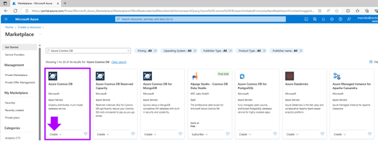
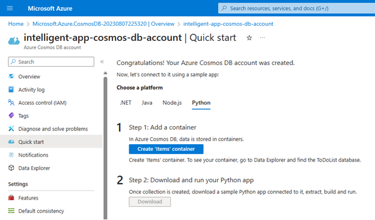
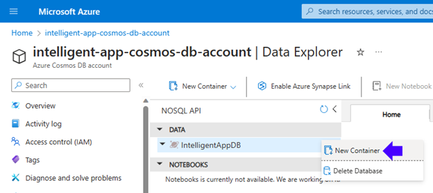

<head>
<meta property="og:url" content="https://azure.github.io/cloud-native/30daysofia/scaling-intelligent-apps-on-azure-kubernetes-services-1"/>
<meta property="og:type" content="website"/>
<meta property="og:title" content="**Fall For Intelligent Apps! 🍂| Build AI Apps On Azure"/>
<meta property="og:description" content="Dive into how to harness AKS’ powerful features like auto-scaling and high availability to manage variable workloads and maintain continuous service."/>
<meta property="og:image" content="https://azure.github.io/Cloud-Native/img/ogImage.png"/>
    <meta name="twitter:url" 
      content="https://azure.github.io/Cloud-Native/30daysofIA/scaling-intelligent-apps-on-azure-kubernetes-services-1" />
    <meta name="twitter:title" 
      content="**Fall For Intelligent Apps! 🍂 | Build AI Apps On Azure" />
    <meta name="twitter:description" 
      content="2-5.Dive into how to harness AKS’ powerful features like auto-scaling and high availability to manage variable workloads and maintain continuous service." />
    <meta name="twitter:image" 
      content="https://azure.github.io/Cloud-Native/img/ogImage.png" />
    <meta name="twitter:card" content="summary_large_image" />
    <meta name="twitter:creator" 
      content="@devanshidiaries" />
    <meta name="twitter:site" content="@AzureAdvocates" /> 
    <link rel="canonical" 
      href="https://azure.github.io/Cloud-Native/30daysofIA/scaling-intelligent-apps-on-azure-kubernetes-services-1" />
</head>

<!-- End METADATA -->
In this article, dive into how to harness AKS’ powerful features like auto-scaling and high availability to manage variable workloads and monitoring to maintain continuous service.

## What We'll Cover:

 * Deploying on Azure Kubernetes Service (AKS) 
 * Configuring AKS for dynamic application scaling
 * Ensuring High Availability with Azure Load Balancer and AKS

## Scaling Intelligent Apps on Azure Kubernetes Services (1) 

In the [first topic of this week](https://azure.github.io/Cloud-Native/30daysofIA/build-your-first-intelligent-app-with-azure-ai-and-aks-1), we explored how to use Azure Cognitive Services for Vision within Azure Kubernetes Service (AKS) to create an Intelligent App capable of analyzing images and extracting valuable data through optical character recognition (OCR). The week’s [second article](https://azure.github.io/Cloud-Native/30DaysOfIA/build-your-first-intelligent-app-with-azure-ai-and-aks-2), focused on the advantages of Azure Cosmos DB, highlighting its multi-model database and ability to handle diverse data resulting from OCR analysis in our Intelligent App. 

In this third topic, we’ll configure [Azure Kubernetes Service (AKS)](https://learn.microsoft.com/en-us/azure/aks/?WT.mc_id=javascript-99907-ninarasi) to manage varying workloads and smoothly scale our Intelligent App, ensuring it can handle intense and fluctuating workloads without compromising performance or availability. 

### Mastering Azure Kubernetes Services (AKS) for Intelligent App

At the core of the Azure ecosystem lies AKS. It plays a crucial role in optimizing application performance and efficient resource use. We can deploy, manage, and scale applications across different environments by precisely orchestrating containerized workloads.  

AKS offers several robust features that help applications scale smoothly and stay available even during heavy demand, including the following: 

 * The [cluster autoscaler](https://learn.microsoft.com/en-us/azure/aks/cluster-autoscalerhttps:/learn.microsoft.com/en-us/azure/aks/?WT.mc_id=javascript-99907-ninarasi) adjusts the number of nodes in your cluster based on how much work you have. This way, it uses resources efficiently and keeps costs in check.  
 * The [Azure Load Balancer](https://azure.microsoft.com/en-ca/products/load-balancer?WT.mc_id=javascript-99907-ninarasi) is created automatically with AKS and acts like an intelligent traffic controller. It ensures incoming network traffic is distributed well across your cluster’s nodes, optimizing resource usage.  

Together, these features give your applications a solid base to handle different workloads and keep running nonstop.  

The following sections provide hands-on demonstrations of setting up, monitoring, and optimizing AKS to drive application efficiency and performance

#### Prerequisites

To follow this tutorial, ensure you have the following:  

* Read through the [first topic of this week](https://azure.github.io/Cloud-Native/30daysofIA/build-your-first-intelligent-app-with-azure-ai-and-aks-1). 
* [Python 3.7](https://www.python.org/downloads/) or later installed  
* [VS Code](https://code.visualstudio.com/download) or another integrated development environment (IDE) for writing Python code  
* The [sample Python application](https://github.com/contentlab-io/Microsoft-Using-Azure-Kubernetes-Service-to-Deploy-an-Intelligent-App-for-Analyzing-Images-2/tree/main/Microsoft_Series_19-20_Code/intelligent-app-before-pt2) downloaded  
* [pip](https://pip.pypa.io/en/stable/installing/), the package manager for Python, installed  
* A [free Azure account](https://azure.microsoft.com/free/?WT.mc_id=javascript-99907-ninarasi). Sign up if you don’t have one yet. 
* The [Azure command-line interface](https://learn.microsoft.com/cli/azure/install-azure-cli?WT.mc_id=javascript-99907-ninarasi) (CLI)

For a look at the final project from this tutorial, review the [complete code](https://github.com/contentlab-io/Microsoft-Using-Azure-Kubernetes-Service-to-Deploy-an-Intelligent-App-for-Analyzing-Images-2/tree/main/Microsoft_Series_19-20_Code/intelligent-app-after-pt2).

Check out the [complete project code](https://github.com/contentlab-io/Microsoft-Using-Azure-Kubernetes-Service-to-Deploy-an-Intelligent-App-for-Analyzing-Images-3/tree/main/Microsoft_21_Code/Deployment) for a preview of the final project.

:::info
Complete the **[Apps Cloud Skills Challenge](https://aka.ms/fallforIA/apps-csc)** to build on your AKS app dev skills.  

To start with the basics for developing [Kubernetes](https://azure.microsoft.com/en-us/products/kubernetes-service/?WT.mc_id=javascript-99907-ninarasi) applications, explore [#30DaysOfCloudNative](https://azure.github.io/Cloud-Native/cnny-2023). 
:::

#### Configuring AKS for Dynamic App Scaling

This section provides step-by-step instructions for setting up a multi-model database with Cosmos DB in your AKS environment. We’ll focus on the preparation, design, and configuration stages.  

Note that an Azure Cosmos DB for NoSQL account isn’t related to your Azure account. An Azure Cosmos DB for NoSQL account is a database service provided by Microsoft Azure for creating, managing, and scaling globally distributed, multi-model databases.  

An Azure Cosmos DB account provides a collection of Azure Cosmos DB assets, such as databases, containers, and items. It also offers an endpoint that facilitates connections for various tools and SDKs, enabling actions within Azure Cosmos DB. For deeper insight into the assets within Azure Cosmos DB, refer to the [Azure Cosmos DB resource model](https://learn.microsoft.com/azure/cosmos-db/resource-model?WT.mc_id=javascript-99907-ninarasi).  

Let’s create an Azure Cosmos DB account using the API for NoSQL. First, [sign](https://portal.azure.com/) in to the Azure portal. From the Azure portal menu or the [homepage](https://portal.azure.com/#home), select **Create a resource**.  

On the **Create a resource** page, search for **Azure Cosmos DB**.

When the results appear, locate the **Azure Cosmos DB** service, then click **Create**.

Next, you’ll see the **Azure Cosmos DB** service page as follows:

The API determines the type of account to create. Select **Azure Cosmos DB API for NoSQL** and click **Create**.

When you reach the Create **Azure Cosmos DB Account** page, enter the settings below for the new account, then click **Review + create**.

 * **Resource Group**: computer-vision
 * **Account Name**: This should be unique to you.
 * **Capacity mode**: Serverless

Finally, review your settings and click the **Create** button.

Next, wait a few minutes until Azure creates the account and click the **Go to resource** button. Wait for the portal to display your new Cosmos DB account’s overview.

We still need to create the NoSQL database. So, select **Data Explorer** on the sidebar. Then select the **New Container** dropdown menu and select **New Database**:

Next, provide “IntelligentAppDB” as the **Database id** and click **OK**:

Now, select the **IntelligentAppDB** database, click the ellipsis (...) icon, and click the **New Container** option:

Provide “ImageAnalysisContainer” as the **Container id** and “Partition1” as the partition key. Then, click **OK** to save the container.

Repeat the previous step to create a new container. Provide “AggregateResultsContainer” as the **Container id** and “/id” as the **Partition key**. Then click **OK** to save the database.

Now, your database and container structure should appear like the image below:

Let’s review the elements of this Cosmos DB setup:  

* **IntelligentAppDB** is a database within Cosmos DB, serving as a high-level container for grouping related data relevant to our Intelligent App.  
* **AggregateResultsContainer** is a container within the IntelligentAppDB database. Containers are where data is stored in Cosmos DB, and this particular container holds data related to aggregate results generated from the Intelligent App.  
* **ImageAnalysisContainer** is another container within the same IntelligentAppDB database. It’s dedicated to storing data pertaining to OCR analysis generated by Azure AI Vision.  

## Exercise

* Complete this **hands-on sample** [project code](https://github.com/contentlab-io/Microsoft-Using-Azure-Kubernetes-Service-to-Deploy-an-Intelligent-App-for-Analyzing-Images-2/tree/main/Microsoft_Series_19-20_Code/intelligent-app-after-pt2) to build your intelligent app with multi-modal databases.  
* Complete the **[AI Cloud Skills Challenge](https://aka.ms/fallforIA/ai-csc)** to build on your app dev and AI skills.  
* Register for **[Ask the Expert: Azure Kubernetes Service](https://reactor.microsoft.com/reactor/series/S-1037/)** session for live Q&A with the Product Engineering team on building intelligent serverless apps.

## Next Steps

Continue to the [next part of this topic](https://azure.github.io/Cloud-Native/30daysofIA/powering-intelligent-apps-with-azure-cosmos-db-2) to further explore loading OCR data into the multi-model database with Azure Cosmos DB, testing the app locally and deploying new version of the intelligent app to Azure Kubernetes Service. Furthermore, learn more about the real-world use cases for multi-model databases.