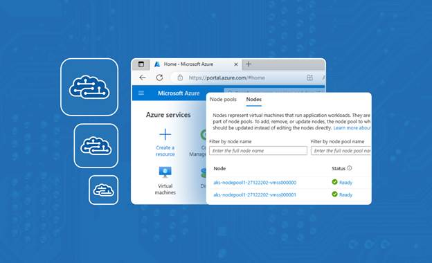
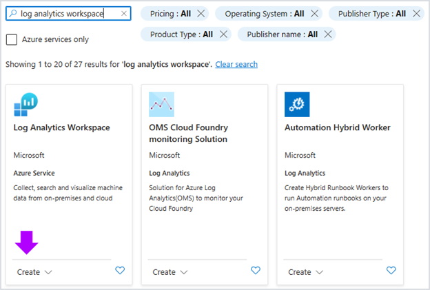
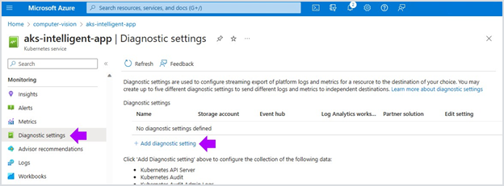
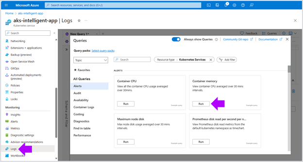
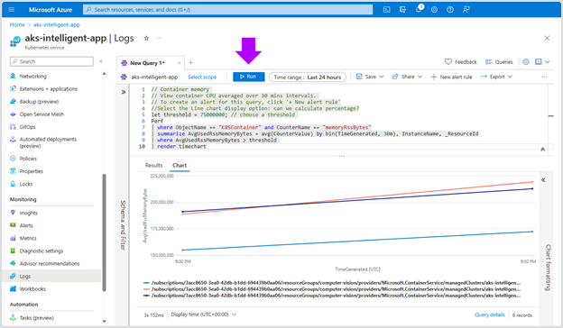
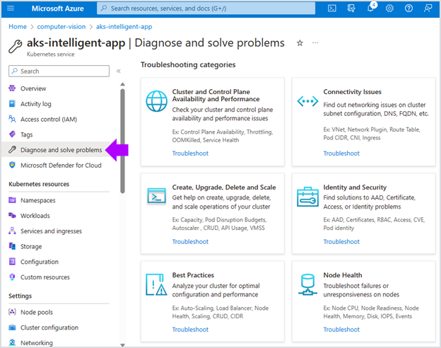
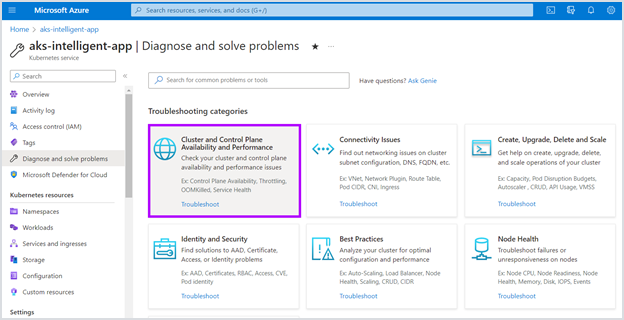

<head>
<meta property="og:url" content="https://azure.github.io/cloud-native/30daysofia/scaling-intelligent-apps-on-azure-kubernetes-services-2"/>
<meta property="og:type" content="website"/>
<meta property="og:title" content="**Fall For Intelligent Apps! 🍂| Build AI Apps On Azure"/>
<meta property="og:description" content="Dive into how to harness AKS’ powerful features like auto-scaling and high availability to manage variable workloads and maintain continuous service."/>
<meta property="og:image" content="https://azure.github.io/Cloud-Native/img/ogImage.png"/>
    <meta name="twitter:url" 
      content="https://azure.github.io/Cloud-Native/30daysofIA/scaling-intelligent-apps-on-azure-kubernetes-services-2" />
    <meta name="twitter:title" 
      content="**Fall For Intelligent Apps! 🍂 | Build AI Apps On Azure" />
    <meta name="twitter:description" 
      content="2-6.Dive into how to harness AKS’ powerful features like auto-scaling and high availability to manage variable workloads and maintain continuous service." />
    <meta name="twitter:image" 
      content="https://azure.github.io/Cloud-Native/img/ogImage.png" />
    <meta name="twitter:card" content="summary_large_image" />
    <meta name="twitter:creator" 
      content="@devanshidiaries" />
    <meta name="twitter:site" content="@AzureAdvocates" /> 
    <link rel="canonical" 
      href="https://azure.github.io/Cloud-Native/30daysofIA/scaling-intelligent-apps-on-azure-kubernetes-services-2" />
</head>

<!-- End METADATA -->
In this article, dive into how to harness AKS’ powerful features like auto-scaling and high availability to manage variable workloads and monitoring to maintain continuous service.

## What We'll Cover:

 * Monitoring AKS for scalability and availability improvements
 * Real-world use cases for scaling and high availability



## Scaling Intelligent Apps on Azure Kubernetes Services (2) 

In the [first topic of this week](https://azure.github.io/Cloud-Native/30daysofIA/build-your-first-intelligent-app-with-azure-ai-and-aks-1), we explored how to use Azure Cognitive Services for Vision within Azure Kubernetes Service (AKS) to create an Intelligent App capable of analyzing images and extracting valuable data through optical character recognition (OCR). The week’s [second topic](https://azure.github.io/Cloud-Native/30daysofIA/powering-intelligent-apps-with-azure-cosmos-db-1) focused on the advantages of Azure Cosmos DB, highlighting its multi-model database and ability to handle diverse data resulting from OCR analysis in our Intelligent App.
 
In the [part one of this third topic](https://azure.github.io/Cloud-Native/30daysofIA/scaling-intelligent-apps-on-azure-kubernetes-services-1), we configured [Azure Kubernetes Service (AKS)](https://learn.microsoft.com/en-us/azure/aks/?WT.mc_id=javascript-99907-ninarasi) to manage varying workloads and smoothly scale our Intelligent App, ensuring it can handle intense and fluctuating workloads. Let us now explore how to monitor and scale without compromising performance or availability.

### Prerequisites

To follow this tutorial, ensure you have read through the [first](https://azure.github.io/Cloud-Native/30daysofIA/scaling-intelligent-apps-on-azure-kubernetes-services-1) part of this topic.

### Monitoring AKS for Scalability and Availability Improvements

Let’s review how to set up and use [Azure Monitor](https://learn.microsoft.com/azure/azure-monitor/overview?WT.mc_id=javascript-99907-ninarasi) and [Azure Log Analytics](https://learn.microsoft.com/azure/azure-monitor/logs/log-analytics-overview?WT.mc_id=javascript-99907-ninarasi) to monitor AKS effectively.
 
First, let’s create a Log Analytics workspace. In Azure Log Analytics, a workspace is a centralized repository and analytics platform that collects, stores, and provides insights into log and telemetry data generated by Azure services, applications, and resources.
 
Click **Create a resource**, search for “Log Analytics workspaces,” then click **Create**.



Next, select the resource group “computer-vision” and, in **Instance details**, set the workspace name as “DefaultLAWorkspace”:


Now, open the `aks-intelligent-app` AKS cluster in the Azure Portal. Open **Diagnostic settings** under the **Monitoring** section and click **Add diagnostic setting**:



Next, give the diagnostic setting a name, like “diagnostic-setting-intelligent-app”. Check all Kubernetes-related log categories, check **AllMetrics**, check **Send to Log Analytics workspace**, and then select the **DefaultLAWorkspace** as the destination. Click the Save button.


Now, let’s view the logs generated by our AKS cluster. Click the **Logs** item under **Monitoring**, then locate the **Container memory** query under the **Alerts** section and click **Run**:


You’ll see that Azure automatically creates the query below for you. This query is written in [Kusto Query Language (KQL)](https://learn.microsoft.com/azure/data-explorer/kusto/query/?WT.mc_id=javascript-99907-ninarasi), which is widely used in Azure Portal:

```
let threshold = 75000000; // choose a threshold 
Perf
| where ObjectName == "K8SContainer" and CounterName == "memoryRssBytes"
| summarize AvgUsedRssMemoryBytes = avg(CounterValue) by bin(TimeGenerated, 30m), InstanceName, _ResourceId
| where AvgUsedRssMemoryBytes > threshold 
| render timechart
```
 
KQL queries are vital in monitoring an AKS cluster, as they provide a powerful and flexible means to extract, analyze, and visualize data from AKS clusters. These queries allow administrators and DevOps teams to get insights into the cluster's health, performance, and security by querying telemetry and logs collected from various sources within the AKS environment.
 
When you click the **Run** button to execute the log query, you get the following chart:



To view the tabular logs, click the **Results** tab as follows:



Next, let’s review how to view key metrics related to the usage of our AKS cluster. Click **Metrics** under **Monitoring**.


Here, we can create one or more charts using predefined metrics to monitor, such as CPU, disk, memory usage, network traffic, and Pod disruption events.
 
[Azure Kubernetes Service Diagnostics](https://learn.microsoft.com/azure/aks/aks-diagnostics?WT.mc_id=javascript-99907-ninarasi) plays a vital role in enhancing the management and performance of Kubernetes clusters within the Azure environment. By enabling diagnostics, we can gain valuable insights into Kubernetes cluster health, availability, and efficiency.
 
Click **Diagnose and solve problems** in the left menu to visualize the many troubleshooting categories.


These categories provide detailed information about issues related to various cluster aspects, including performance, connectivity, scalability, security, node health, and best practices.
 
Now, let’s explore the details of one of these AKS cluster issues. Click the **Cluster and Control Plane Availability and Performance** blade:



Here, you can verify the existence of many possible issues regarding cluster availability and performance:



Azure Kubernetes Service Diagnostics is a critical tool for monitoring, maintaining, and optimizing AKS clusters. AKS Diagnostics lets you identify potential issues and make data-driven improvements by offering real-time insights and recommendations across various facets of cluster health, performance, and security.

:::info
Complete the **[Apps Cloud Skills Challenge](https://aka.ms/fallforIA/apps-csc)** to build on your AKS app dev skills. 
 
To start with the basics for developing [Kubernetes](https://azure.microsoft.com/products/kubernetes-service/?WT.mc_id=javascript-99907-ninarasi) applications, explore [#30DaysOfCloudNative](https://azure.github.io/Cloud-Native/cnny-2023).
:::


## Exercise

* Complete this **hands-on sample** [project code](https://github.com/contentlab-io/Microsoft-Using-Azure-Kubernetes-Service-to-Deploy-an-Intelligent-App-for-Analyzing-Images-2/tree/main/Microsoft_Series_19-20_Code/intelligent-app-after-pt2) to build your intelligent app with multi-modal databases.  
* Complete the **[AI Cloud Skills Challenge](https://aka.ms/fallforIA/ai-csc)** to build on your app dev and AI skills.  
* Register for **[Ask the Expert: Azure Kubernetes Service](https://reactor.microsoft.com/reactor/series/S-1037/)** session for live Q&A with the Product Engineering team on building intelligent serverless apps.

## Next Steps

Continue to the [next part of this topic](https://azure.github.io/Cloud-Native/30daysofIA/powering-intelligent-apps-with-azure-cosmos-db-2) to further explore loading OCR data into the multi-model database with Azure Cosmos DB, testing the app locally and deploying new version of the intelligent app to Azure Kubernetes Service. Furthermore, learn more about the real-world use cases for multi-model databases.