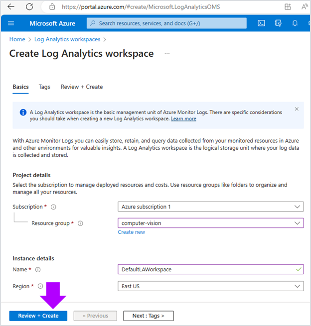
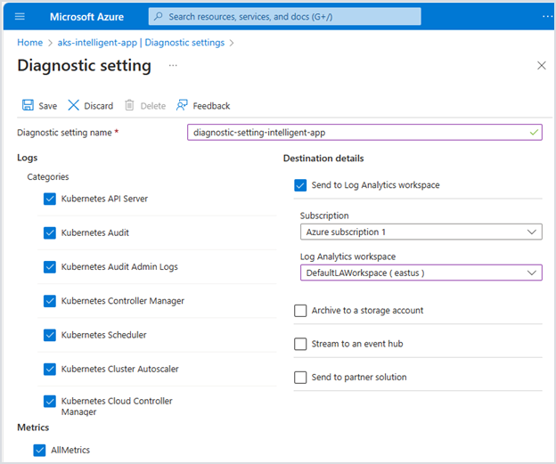
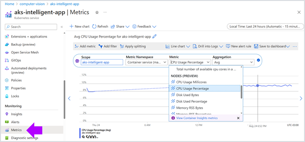
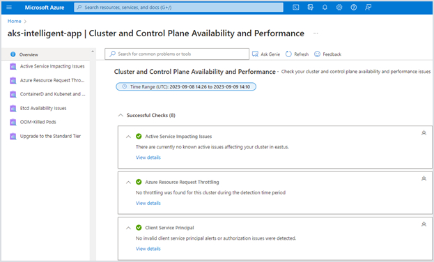

<head>
<meta property="og:url" content="https://azure.github.io/cloud-native/30daysofia/scaling-intelligent-apps-on-azure-kubernetes-services-2"/>
<meta property="og:type" content="website"/>
<meta property="og:title" content="**Fall For Intelligent Apps! 🍂| Build AI Apps On Azure"/>
<meta property="og:description" content="Dive into how to harness AKS’ powerful features like auto-scaling and high availability to manage variable workloads and maintain continuous service."/>
<meta property="og:image" content="https://azure.github.io/Cloud-Native/img/ogImage.png"/>
    <meta name="twitter:url" 
      content="https://azure.github.io/Cloud-Native/30daysofIA/scaling-intelligent-apps-on-azure-kubernetes-services-2" />
    <meta name="twitter:title" 
      content="**Fall For Intelligent Apps! 🍂 | Build AI Apps On Azure" />
    <meta name="twitter:description" 
      content="2-6.Dive into how to harness AKS’ powerful features like auto-scaling and high availability to manage variable workloads and maintain continuous service." />
    <meta name="twitter:image" 
      content="https://azure.github.io/Cloud-Native/img/ogImage.png" />
    <meta name="twitter:card" content="summary_large_image" />
    <meta name="twitter:creator" 
      content="@devanshidiaries" />
    <meta name="twitter:site" content="@AzureAdvocates" /> 
    <link rel="canonical" 
      href="https://azure.github.io/Cloud-Native/30daysofIA/scaling-intelligent-apps-on-azure-kubernetes-services-2" />
</head>

<!-- End METADATA -->
In this article, dive into how to harness AKS’ powerful features like auto-scaling and high availability to manage variable workloads and monitoring to maintain continuous service.

## What We'll Cover:

 * Monitoring AKS for scalability and availability improvements
 * Real-world use cases for scaling and high availability


## Scaling Intelligent Apps on Azure Kubernetes Services (2) 

In the [first topic of this week](https://azure.github.io/Cloud-Native/30daysofIA/build-your-first-intelligent-app-with-azure-ai-and-aks-1), we explored how to use Azure Cognitive Services for Vision within Azure Kubernetes Service (AKS) to create an Intelligent App capable of analyzing images and extracting valuable data through optical character recognition (OCR). The week’s [second topic](https://azure.github.io/Cloud-Native/30daysofIA/powering-intelligent-apps-with-azure-cosmos-db-1) focused on the advantages of Azure Cosmos DB, highlighting its multi-model database and ability to handle diverse data resulting from OCR analysis in our Intelligent App.
 
In the [part one of this third topic](https://azure.github.io/Cloud-Native/30daysofIA/scaling-intelligent-apps-on-azure-kubernetes-services-1), we configured [Azure Kubernetes Service (AKS)](https://learn.microsoft.com/en-us/azure/aks/?WT.mc_id=javascript-99907-ninarasi) to manage varying workloads and smoothly scale our Intelligent App, ensuring it can handle intense and fluctuating workloads. Let us now explore how to monitor and scale without compromising performance or availability.

### Prerequisites

To follow this tutorial, ensure you have read through the [first](https://azure.github.io/Cloud-Native/30daysofIA/scaling-intelligent-apps-on-azure-kubernetes-services-1) part of this topic.

### Monitoring AKS for Scalability and Availability Improvements

Let’s review how to set up and use [Azure Monitor](https://learn.microsoft.com/azure/azure-monitor/overview?WT.mc_id=javascript-99907-ninarasi) and [Azure Log Analytics](https://learn.microsoft.com/azure/azure-monitor/logs/log-analytics-overview?WT.mc_id=javascript-99907-ninarasi) to monitor AKS effectively.
 
First, let’s create a Log Analytics workspace. In Azure Log Analytics, a workspace is a centralized repository and analytics platform that collects, stores, and provides insights into log and telemetry data generated by Azure services, applications, and resources.
 
Click **Create a resource**, search for “Log Analytics workspaces,” then click **Create**.


Next, select the resource group “computer-vision” and, in **Instance details**, set the workspace name as “DefaultLAWorkspace”:



Now, open the `aks-intelligent-app` AKS cluster in the Azure Portal. Open **Diagnostic settings** under the **Monitoring** section and click **Add diagnostic setting**:


Next, give the diagnostic setting a name, like “diagnostic-setting-intelligent-app”. Check all Kubernetes-related log categories, check **AllMetrics**, check **Send to Log Analytics workspace**, and then select the **DefaultLAWorkspace** as the destination. Click the Save button.



Now, let’s view the logs generated by our AKS cluster. Click the **Logs** item under **Monitoring**, then locate the **Container memory** query under the **Alerts** section and click **Run**:


You’ll see that Azure automatically creates the query below for you. This query is written in [Kusto Query Language (KQL)](https://learn.microsoft.com/azure/data-explorer/kusto/query/?WT.mc_id=javascript-99907-ninarasi), which is widely used in Azure Portal:

```
let threshold = 75000000; // choose a threshold 
Perf
| where ObjectName == "K8SContainer" and CounterName == "memoryRssBytes"
| summarize AvgUsedRssMemoryBytes = avg(CounterValue) by bin(TimeGenerated, 30m), InstanceName, _ResourceId
| where AvgUsedRssMemoryBytes > threshold 
| render timechart
```
 
KQL queries are vital in monitoring an AKS cluster, as they provide a powerful and flexible means to extract, analyze, and visualize data from AKS clusters. These queries allow administrators and DevOps teams to get insights into the cluster's health, performance, and security by querying telemetry and logs collected from various sources within the AKS environment.
 
When you click the **Run** button to execute the log query, you get the following chart:


To view the tabular logs, click the **Results** tab as follows:


Next, let’s review how to view key metrics related to the usage of our AKS cluster. Click **Metrics** under **Monitoring**.



Here, we can create one or more charts using predefined metrics to monitor, such as CPU, disk, memory usage, network traffic, and Pod disruption events.
 
[Azure Kubernetes Service Diagnostics](https://learn.microsoft.com/azure/aks/aks-diagnostics?WT.mc_id=javascript-99907-ninarasi) plays a vital role in enhancing the management and performance of Kubernetes clusters within the Azure environment. By enabling diagnostics, we can gain valuable insights into Kubernetes cluster health, availability, and efficiency.
 
Click **Diagnose and solve problems** in the left menu to visualize the many troubleshooting categories.


These categories provide detailed information about issues related to various cluster aspects, including performance, connectivity, scalability, security, node health, and best practices.
 
Now, let’s explore the details of one of these AKS cluster issues. Click the **Cluster and Control Plane Availability and Performance** blade:


Here, you can verify the existence of many possible issues regarding cluster availability and performance:



Azure Kubernetes Service Diagnostics is a critical tool for monitoring, maintaining, and optimizing AKS clusters. AKS Diagnostics lets you identify potential issues and make data-driven improvements by offering real-time insights and recommendations across various facets of cluster health, performance, and security.

:::info
Complete the **[Apps Cloud Skills Challenge](https://aka.ms/fallforIA/apps-csc)** to build on your AKS app dev skills. 
 
To start with the basics for developing [Kubernetes](https://azure.microsoft.com/products/kubernetes-service/?WT.mc_id=javascript-99907-ninarasi) applications, explore [#30DaysOfCloudNative](https://azure.github.io/Cloud-Native/cnny-2023).
:::

### Real-World Use Cases: Scaling and High Availability in Intelligent Apps

The cluster autoscaler, Azure Load Balancer, and Azure availability zones promote cost-efficiency for Intelligent Apps, evenly distributing traffic and optimizing service performance, ensuring uninterrupted user experiences.
 
These versatile tools have broad applicability across industries, including finance, healthcare, e-commerce, and beyond, particularly for mission-critical applications with variable workloads and high uptime demands.

#### E-Commerce Businesses

E-commerce businesses must handle traffic that varies dramatically during special events or holiday seasons. Their websites require high uptime and disaster recovery capabilities.
 
These businesses can experience significant setbacks during periods of heavy user traffic or technical glitches, potentially leading to customer dissatisfaction, abandoned shopping carts, and lost sales.
 
By implementing a high availability strategy with Intelligent Apps, e-commerce businesses can ensure uninterrupted service, website responsiveness, and seamless online shopping experience, ultimately boosting customer satisfaction and revenue. Tools like the cluster autoscaler and Azure Load Balancer ensure that e-commerce businesses have the resources and capacity to handle high traffic effortlessly.

#### Healthcare Institutions

Healthcare institutions require data reliability and disaster recovery capabilities. In healthcare, applications often need to process large volumes of patient data and images, especially during diagnostic procedures.
 
By strategically implementing and managing Intelligent Apps with tools like Azure Load Balancer, availability zones, and cluster autoscaler, healthcare organizations ensure that their digital infrastructure aligns with operational goals. Moreover, they can enhance patient care and regulatory compliance while containing costs and mitigating risks.

#### Financial Services

Financial services organizations often have applications that handle trading, analytics, and customer transactions. These organizations require high availability and data residency compliance.
 
For example, banking apps face challenges during heavy usage or technical hiccups. A surge in users accessing their accounts simultaneously, such as during peak hours or special events, can strain the app's servers, causing slowdowns or timeouts.
 
Together, tools like Azure Load Balancer, availability zones, and the cluster autoscaler help banking apps keep data in the required regions, handle surges in activity, stay resilient, and provide customers with a smooth and reliable banking experience.

:::info
Join the team of Microsoft Azure experts in-person at [Azure Day with Kubernetes for KubeCon](https://aka.ms/aks-day). Learn best practices for building cloud-native and intelligent apps with Kubernetes on Azure.
:::

### Optimizing Our Intelligent App

To optimize the Intelligent App from [Topic 1](https://azure.github.io/Cloud-Native/30DaysOfIA/build-your-first-intelligent-app-with-azure-ai-and-aks-1) for dynamic scaling and uninterrupted service when processing images with OCR and storing unstructured results in Cosmos DB, you could follow these strategies:
 
* Configure the cluster autoscaler to adjust the AKS cluster’s node count based on workload fluctuations. During surges in image processing, it scales out by provisioning additional nodes for efficient handling. Conversely, during low-demand periods, it scales in to reduce operational costs while maintaining performance.
* Use the AKS HPA to scale application pods dynamically within the cluster. HPA monitors custom metrics like queue length or processing time. When thresholds are exceeded, it automatically adjusts the number of pods, ensuring that OCR processing workloads are efficiently distributed across multiple pods for uninterrupted service.
* Leverage the Azure Load Balancer to distribute image processing requests evenly across app instances, optimizing performance and preventing overloads. Deploy app instances across Azure availability zones for redundancy and fault tolerance. Health probes actively monitor instance health, directing traffic away from unhealthy instances to maintain high availability.
* Optimize your containers’ resource use. Fine-tune resource requests and limits for app containers to ensure efficient resource use and stability. Continuously monitor container resource use and adjust resource allocation based on observed usage patterns using tools like Prometheus and Grafana.

## Exercise

* Complete this **hands-on sample** [project code](https://github.com/contentlab-io/Microsoft-Scaling-Intelligent-Apps-on-Azure-Kubernetes-Services/tree/main/Microsoft_21_Code/Deployment) to scale and monitor your intelligent app on AKS.  
* Register for the **[Learn Live: Kubernetes Edition](https://learn.microsoft.com/events/learn-events/learnlive-intelligent-apps-with-azure-kubernetes-service/?WT.mc_id=javascript-99907-ninarasi)** starting Oct 12 - a live SME guided walkthrough on a reference architecture to build intelligent apps with AKS and Azure Open AI  
* Register for [Ask the Expert: Azure Kubernetes Service](https://reactor.microsoft.com/reactor/series/S-1037/) session for live Q&A with the Product Engineering team on building intelligent apps with AKS.

## Next Steps

Azure Kubernetes Service offers a robust solution for scaling and ensuring high availability in intelligent applications. It provides automated tools for setting up, managing, and expanding containerized applications using Kubernetes. Its support for scalability and availability prevents disruptions, supports downtime-free updates, and enables you to create a high-performance Intelligent App.
 
[Dive deeper](https://azure.microsoft.com/products/kubernetes-service#get-started?WT.mc_id=javascript-99907-ninarasi) into the features of Azure Kubernetes Services to fully realize its potential in scaling and managing your Intelligent Apps.