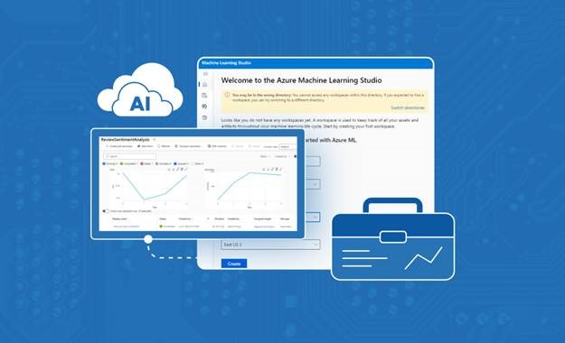
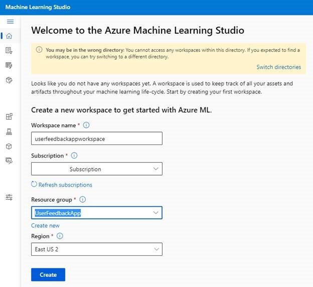
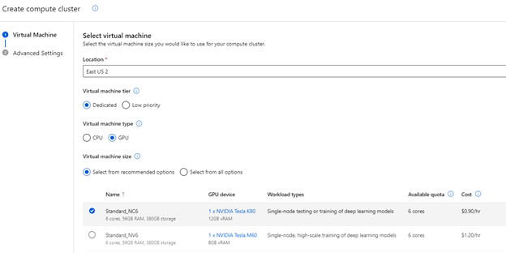
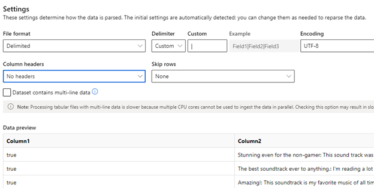
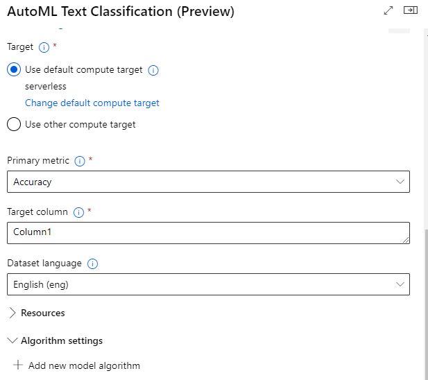
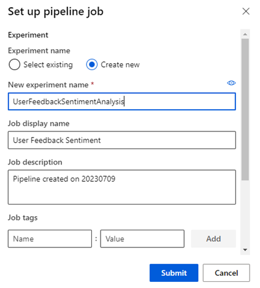
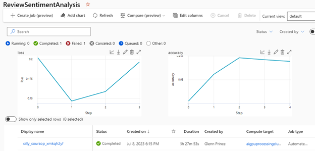

<head>
<meta property="og:url" content="https://azure.github.io/cloud-native/30daysofia/taking-intelligent-apps-to-the-next-level-implementing-advanced-features-with-azure-machine-learning-1"/>
<meta property="og:type" content="website"/>
<meta property="og:title" content="Build Intelligent Apps!| Build AI Apps On Azure"/>
<meta property="og:description" content="Explore how to level up your Intelligent Apps by training a custom model using your own dataset with Azure Machine Learning and Azure Container Apps."/>
<meta property="og:image" content="https://azure.github.io/Cloud-Native/img/ogImage.png"/>
    <meta name="twitter:url" 
      content="https://azure.github.io/Cloud-Native/30daysofIA/taking-intelligent-apps-to-the-next-level-implementing-advanced-features-with-azure-machine-learning-1" />
    <meta name="twitter:title" 
      content="Build Intelligent Apps! | Build AI Apps On Azure" />
    <meta name="twitter:description" 
      content="3.3 Taking Intelligent Apps to the Next Level: Implementing Advanced Features with Azure Machine Learning-1." />
    <meta name="twitter:image" 
      content="https://azure.github.io/Cloud-Native/img/ogImage.png" />
    <meta name="twitter:card" content="summary_large_image" />
    <meta name="twitter:creator" 
      content="@devanshidiaries" />
    <meta name="twitter:site" content="@AzureAdvocates" /> 
    <link rel="canonical" 
      href="https://azure.github.io/Cloud-Native/30daysofIA/https://azure.github.io/Cloud-Native/30daysofIA/taking-intelligent-apps-to-the-next-level-implementing-advanced-features-with-azure-machine-learning-1" />
</head>

<!-- End METADATA -->
In this article, explore how to level up your Intelligent Apps by training a custom model using your own dataset with [Azure Machine Learning](https://learn.microsoft.com/en-us/azure/machine-learning/overview-what-is-azure-machine-learning?view=azureml-api-2&WT.mc_id=javascript-99907-ninarasi) and [Azure Container Apps](https://learn.microsoft.com/en-us/azure/container-apps/overview?WT.mc_id=javascript-99907-ninarasi).

## What We'll Cover:

 * Understanding Azure Machine Learning 
 * Environment setup in Azure Machine Learning
 * Training a model with Azure Machine Learning 

## Taking Intelligent Apps to the Next Level: Implementing Advanced Features with Azure Machine Learning (1)

In the [first topic of this series](https://azure.github.io/Cloud-Native/30DaysOfIA/deploy-an-intelligent-app-on-azure-container-apps-1), we explored the process of constructing an Intelligent App using [Azure Container Apps](https://azure.microsoft.com/products/container-apps?WT.mc_id=javascript-99907-ninarasi) that incorporated [Azure AI](https://azure.microsoft.com/solutions/ai/?WT.mc_id=javascript-99907-ninarasi) to perform sentiment analysis on user feedback.

In this second topic tutorial, we’ll enhance the [Intelligent App we created](https://github.com/contentlab-io/Microsoft-Building-Your-First-Intelligent-App-with-Azure-Cognitive-Services/tree/main/Microsoft_Series_2_Code/Source%20-%20Article%207%20%2B%208/UserFeedbackApp) by training a custom AI model using targeted data. We’ll walk through how you can incorporate these custom models, trained within Azure Machine Learning (ML), into your application. Just as we used Azure AI, we’ll deploy and leverage an endpoint to make the most of this integration.

## Solution Architecture

The image below shows the architecture of the solution we’re aiming for in this article.

## Advanced Features with Azure Machine Learning

[Azure Machine Learning](https://azure.microsoft.com/en-ca/products/machine-learning?WT.mc_id=javascript-99907-ninarasi) is a robust cloud-based platform that empowers developers and data scientists to build, deploy, and manage ML models efficiently. It offers a comprehensive suite of tools and services to streamline the end-to-end ML lifecycle.

With Azure ML, we can prepare, explore, clean, and transform datasets for model training. The platform also provides a range of inbuilt algorithms and frameworks for building models, such as TensorFlow, PyTorch, and scikit-learn, as well as a graphical user interface (GUI) to simplify creating models and testing experiments.

Scalable computational resources, such as Server and GPU clusters, fuel this process, helping train models on large datasets. Azure ML aids in deploying models as web services or containers, making integrating them into production environments straightforward.

Integration with other Azure services, such as [Azure Databricks](https://learn.microsoft.com/en-us/azure/databricks/introduction/?WT.mc_id=javascript-99907-ninarasi) and [Azure Data Lake Storage](https://learn.microsoft.com/en-us/azure/storage/blobs/data-lake-storage-introduction?WT.mc_id=javascript-99907-ninarasi), ensures smooth data ingestion and integration into ML workflows.

While ready-made models like the Azure AI model we used in part one of this series are convenient, they might not capture the intricacies of every application, leading to suboptimal results. Developing custom models allows for tailored solutions to specific problems or datasets, improving accuracy and relevance.

Training a custom model also gives us greater control over the data, features, and architecture. This enables performance optimization, bias mitigation, and model fine-tuning to meet evolving application requirements.

In this article, we’ll explore how to get better results from the [Azure AI Sentiment Analysis API](https://learn.microsoft.com/en-us/azure/ai-services/language-service/sentiment-opinion-mining/overview?tabs=prebuilt?WT.mc_id=javascript-99907-ninarasi) by:

* Training our own AI model using Azure ML Studio with a large dataset of specific user reviews
* Creating the infrastructure to support model development
* Loading our dataset and performing data cleaning
* Building and testing our model training pipeline
* Deploying our model

### Prerequisites

To follow this tutorial, we need:

* The [project created in part one](https://github.com/contentlab-io/Microsoft-Building-Your-First-Intelligent-App-with-Azure-Cognitive-Services/tree/main/Microsoft_Series_2_Code/Source%20-%20Article%207%20%2B%208) downloaded
* An [Azure account](https://azure.microsoft.com/free/)
* [Docker Desktop](https://www.docker.com/products/docker-desktop/) version 3.5.1 or higher
* [Visual Studio](https://visualstudio.microsoft.com/downloads/) installed. This demonstration uses Community Edition 2022.

For a peek at the final application, check out the [complete project code](https://github.com/contentlab-io/Microsoft-Building-Your-First-Intelligent-App-with-Azure-Cognitive-Services).

Let’s dive in.

### Environment Setup in Azure Machine Learning

Before using our data to build a training pipeline, we need to configure an ML environment. Navigate to the [Machine Learning page](https://ml.azure.com/) and log in using your Azure username and password.

Opening Azure ML will prompt you to create a workspace with a workspace name, associated Azure subscription, resource group, and region.

Next, we must create some compute resources to train our models. Azure ML provides two options:

* A single compute instance—or virtual machine (VM)
* A cluster or scalable virtual machine set

The cluster provides the most flexibility, so select that option.

It’s recommended to select a GPU type for the VM because we’ll train our model using an automated process. Because VM options are always changing and updating, the list of options available might be different while you’re working. But the key is to pick a GPU-equipped option. This significantly improves performance, as these AI models work more efficiently with GPU instructions.

If a GPU-based VM isn’t available, you can go for a high-RAM instance in the memory-optimized range, like Standard_E4ds_v4. However, be prepared for a longer processing time in this case.

:::info
Register to meet the Azure team at **[KubeCon and Azure Day](https://aka.ms/aks-day)** in Chicago on **November 6, 2023**. The Azure Product Engineering Team along with the Cloud Advocates team will be there to dive deep with you on developing intelligent apps with Azure Kubernetes Service.
:::

### Training the Model in Azure Machine Learning

Now that our infrastructure is in place, let’s start building and training our model. Generally, the more data you have when training your AI model, the better its decisions will be. Ideally, you’d also use your app-generated data to build this model, ensuring it’s tailored to your use case.

Because we don’t have a specific internal review dataset, we’ll work with sample data from Kaggle. Specifically, we’ll use a trimmed-down version of an [Amazon reviews dataset](https://www.kaggle.com/datasets/kritanjalijain/amazon-reviews) to train a sentiment analysis model. This reduces time while still delivering valuable insights. In a real-life scenario, your dataset might be larger and less polished, so we’ll review some data cleaning options in Azure ML later.

First, let’s add the datasets we’ll use into Azure ML. Create a new data asset named “ReviewTrainingData.”

Select **Use from local files** and upload the `train.txt` file into your Blob storage bucket. Next, click **Custom delimiter**, select the “|” character, and ensure there are no headers, as our data files follow this format.

Click **Next** to see the schema. The first column should be set to Boolean and the second column should be the review text. Save this dataset and repeat this process for the `test.txt` file, naming it “ReviewValidationData.”

Now that we’ve got our data, let’s build our model training pipeline. Access the **Pipelines** option from the left-side menu bar, and select **Create a new pipeline using custom components**. The pipeline view is where we configure data manipulation, dataset cleaning, model training, validation, and publishing to an endpoint.

There are three key elements we can add to a pipeline:

* **Data**—This contains the data assets used to train, validate, and test your AI models.
* **Model**—This contains pre-trained AI models that you can integrate into your pipelines for data transformation, manipulation, or other tasks.
* **Components**—These are code blocks you use to help train the model you’re building.

Our dataset is already clean, so we can skip transformation and data cleaning. If needed, check out the [Azure Machine Learning documentation](https://learn.microsoft.com/en-us/azure/machine-learning/component-reference/component-reference?view=azureml-api-2) to review these tasks for future use.

Next, we’ll add component algorithms to train our model. The Azure ML Studio offers pre-built components or the option for custom-developed components. These components are building blocks—code or existing models—that Azure ML uses for data training. These could be custom code created in Jupyter Notebooks, existing AI models you previously trained, or open-source models from platforms like [HuggingFace](https://huggingface.co/).

For sentiment analysis, we’ll use Azure ML’s pre-built [AutoML](https://azure.microsoft.com/en-ca/products/machine-learning/automatedml/) Text Classification component. AutoML simplifies ML by allowing us to perform tasks like classification, regression, forecasting, vision, or natural language processing (NLP) using existing algorithms.

In this tutorial, we’ll input `training_data` and `validation_data` into the AutoML component. This generates the best model based on a primary metric, which is the column specifying the outcome of the data. For our dataset, it’s the column that labels a review as positive or negative. However, the information could be more granular if required, such as a positive/negative percentage.

Drag the AutoML Text Classification component onto the canvas. Connect the training and validation data to the corresponding points on the AutoML text box, as shown below.

Double-click the AutoML Text Classification component to specify settings for this component. Key settings include:

* Compute resources for training the model
* The primary metric for validating the model
* Target column (what the AI predicts)
* Dataset language

This particular component also lets you pick an algorithm for greater control, such as bert-base, roberta, or xlnet model types. For example, we can select the bert-base algorithm as this has [better overall performance for this task](https://techcommunity.microsoft.com/t5/ai-machine-learning-blog/how-bert-is-integrated-into-azure-automated-machine-learning/ba-p/1194657). The settings and details vary for each component, so it’s worth experimenting with different algorithms depending on your needs and desired outcome.

For our relatively straightforward enhancement in this application, we’re using just one training component. But keep in mind, depending on your AI training goals, you can connect different components and models as needed. For instance, you might want to break down reviews, categorize subjects, assign sentiments to phrases, and, finally, provide an overall sentiment.

For this more complex process, your training and testing data would need to include these breakdowns and sentiments before you can train the model. Also, remember that each step in a model training process can take time, based on your data’s size and complexity. The component would then generate an object called “best model,” which is the trained ML model.

We can also add an extra to register and deploy the model. However, in this article, we’ll skip that because we’ll need to customize some of the later elements that host our model.

Now, we’re all set to train our model with the pipeline. Click **Configure and Submit** in the upper-right corner. In the **Set up pipeline job** screen, provide the experiment name, add tags or details if needed, and confirm to start the job. You can rename the pipeline to something more usable, like “User Feedback Sentiment.” At this stage, you can change other settings too, but for now, save the pipeline and click **Submit** to start building the model.

Note that building the model can take time, especially with larger datasets. The simplified dataset we’re using here takes about 8.5 hours to train. So, remember that you’ll be incurring the cost of the compute instance you selected during this time. If you’d rather not wait, [download the model](https://github.com/contentlab-io/Microsoft-Intelligent-Apps-With-Azure-AI-Services/tree/main/Microsoft_Series_2_Code/Source%20-%20Article%207%20%2B%208/UserFeedbackApp/Models) and proceed with the tutorial. Later, we’ll review where you can upload a pre-trained model instead of using the one that the pipeline generates.

Now, go to the **Jobs** menu to see the pipelines you have running. At this stage, you’ll have to wait for the job to finish for the model to train fully. This will take around 8.5 hours. Just remember that Azure ML restricts learning pipelines to a 24-hour runtime. If you have larger pipelines, you’ll need to tweak your job settings to prevent timeouts.

Once the pipeline job finishes, you can assess the model’s performance with the test data by clicking on the job, which displays an accuracy graph.

## Exercise

* Complete this **hands-on sample** [project code](https://github.com/contentlab-io/Microsoft-Building-Your-First-Intelligent-App-with-Azure-Cognitive-Services/tree/main/Microsoft_Series_2_Code/Source%20-%20Article%207%20%2B%208/UserFeedbackApp/Models) to build your intelligent app with multi-modal databases.
* Complete the **[Intelligent apps Cloud Skills Challenge](https://aka.ms/fallforIA/apps-csc)** to build on your app dev and AI skills.
* Watch the **[Ask the Expert: Azure Container Apps](https://reactor.microsoft.com/en-us/reactor/events/20728/?WT.mc_id=javascript-99907-ninarasi)** session where the Product Engineering team goes deep with demos while addressing the concepts for building intelligent apps using Azure Container Apps.