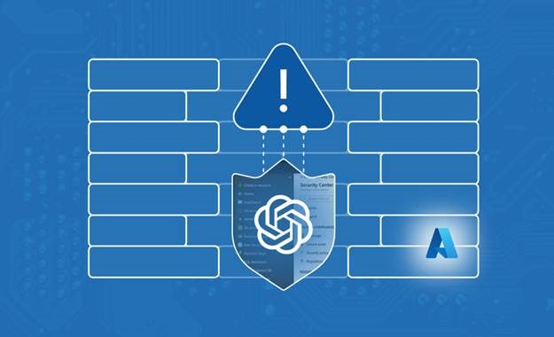
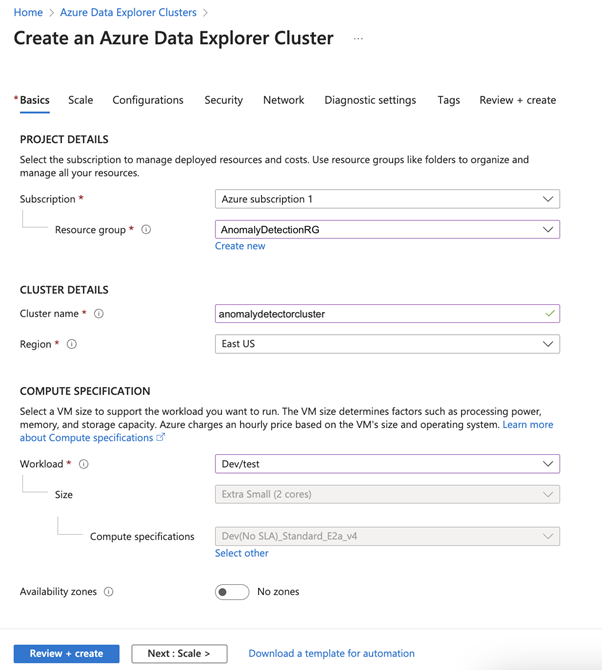
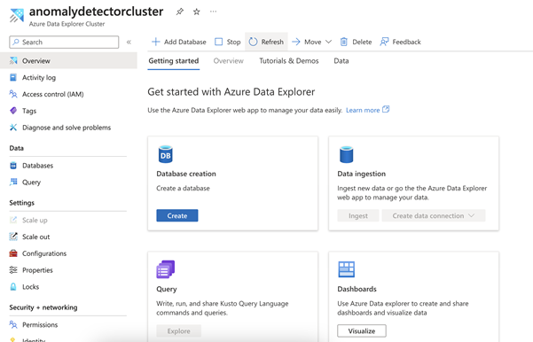
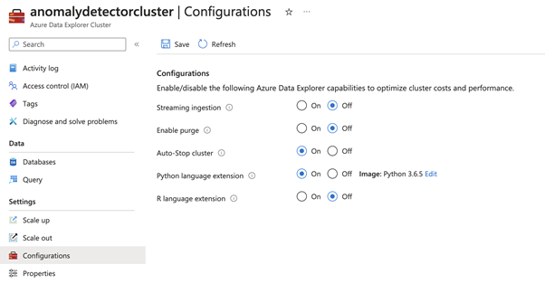
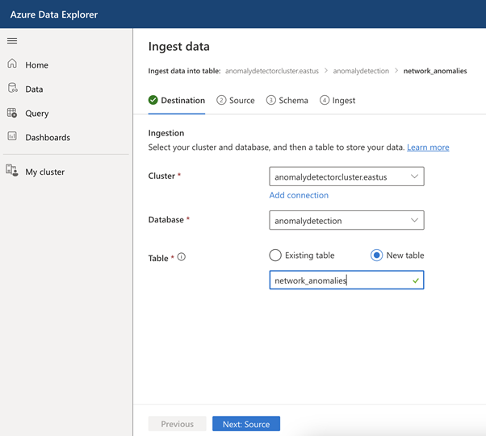
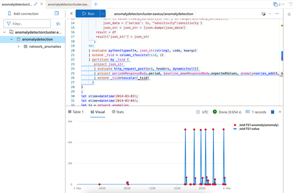

<head>
<meta property="og:url" content="https://azure.github.io/cloud-native/30daysofia/fortifying-cybersecurity-using-intelligent-apps-on-aks-2"/>
<meta property="og:type" content="website"/>
<meta property="og:title" content="Build Intelligent Apps! | Build AI Apps On Azure"/>
<meta property="og:description" content="Discover how to enhance the security of our Intelligent Apps with Azure AI Anomaly Detector and Azure Kubernetes Service."/>
<meta property="og:image" content="https://azure.github.io/Cloud-Native/img/ogImage.png"/>
    <meta name="twitter:url" 
      content="https://azure.github.io/Cloud-Native/30daysofIA/fortifying-cybersecurity-using-intelligent-apps-on-aks-2" />
    <meta name="twitter:title" 
      content="Build Intelligent Apps! | Build AI Apps On Azure" />
    <meta name="twitter:description" 
      content="4-4. Fortifying Cybersecurity Using Intelligent Apps on AKS (2)" 
      content="https://azure.github.io/Cloud-Native/img/ogImage.png" />
    <meta name="twitter:card" content="summary_large_image" />
    <meta name="twitter:creator" 
      content="@devanshidiaries" />
    <meta name="twitter:site" content="@AzureAdvocates" /> 
    <link rel="canonical" 
      href="https://azure.github.io/Cloud-Native/30daysofIA/fortifying-cybersecurity-using-intelligent-apps-on-aks-2" />
</head>

<!-- End METADATA -->
In this article, discover how to enhance the security of our Intelligent Apps with [Azure AI Anomaly Detector](https://learn.microsoft.com/azure/ai-services/anomaly-detector/overview?WT.mc_id=javascript-99907-ninarasi) and [Azure Kubernetes Service (AKS)](https://learn.microsoft.com/azure/aks/?WT.mc_id=javascript-99907-ninarasi). Follow along to learn how to implement real-time monitoring and anomaly detection of network traffic and make data-driven security decisions to protect against emerging cyber threats.

## What We'll Cover:

 * Storing and Reviewing Detected Anomalies
 * Intelligent Apps and Cybersecurity concepts



## Fortifying Cybersecurity Using Intelligent Apps on AKS: Hands-on with AI-Powered Anomaly Detection (2)

In the [previous part](https://azure.github.io/Cloud-Native/30daysofIA/fortifying-cybersecurity-using-intelligent-apps-on-aks-1) of this tutorial, we explored creating an intelligent app for real-time network traffic anomaly detection using Azure AI and AKS. This part continues onto storing and reviewing the detected anomalies. 

### Prerequisites

To follow this tutorial, ensure you have completed the [first](https://azure.github.io/Cloud-Native/30daysofIA/fortifying-cybersecurity-using-intelligent-apps-on-aks-1) part of this topic.

### Storing and Reviewing Detected Anomalies

[Azure Data Explorer](https://learn.microsoft.com/azure/ai-services/anomaly-detector/tutorials/azure-data-explorer?WT.mc_id=javascript-99907-ninarasi) is a powerful tool for data analysis and querying. We’ll now set up an Azure Data Explorer cluster and import our dataset to visualize the anomalies. Graphically representing them can make it easier to spot patterns.

First, we need to create an Azure Data Explorer cluster. Return to Azure and search for “Azure Data Explorer Clusters.” Select it, click **Create**, and pick the same resource group used for the anomaly detection instance. Assign a unique name, such as anomalydetectioncluster. Within the **COMPUTE SPECIFICATION** section, opt for the **Dev/test** workload and disable the **Availability zones** option. This choice will provide a modest, budget-friendly cluster for our demo. For production workloads, you may want to use another size.



The cluster will take some time to generate. Once it’s ready, we’ll require a database to work with the data. From the cluster’s **Overview** page, hit **Add database**. Name the database and leave the other settings unchanged.



To work with the data, we need to set up permissions. In the Azure Data Explorer portal, navigate to the **Permissions** section under the **Security + Networking**. Add the **AllDatabasesAdmin** and **AllDatabasesViewer** permissions to your Azure user.


:::info
Join the Azure team at **[KubeCon and Azure Day](https://aka.ms/aks-day)** in Chicago on **November 6, 2023**. The Azure Product Engineering team along with the Cloud Advocates team will be there to dive deep with you on developing intelligent apps with Azure Kubernetes Service.
:::

Now, let’s configure Python to allow calls to the Anomaly Detection API.

To use Python for data analysis, access the **Configurations** menu from the sidebar and enable the Python language extension. Keep in mind that it may take up to an hour for these changes to take effect:



Now, navigate to the Azure Data Explorer console. From the cluster’s main overview page under the **Getting started** tab, click **Query your data** from the **Explore in Azure Data Explorer** box.

Navigate to the **Data** tab, then click **Ingest Data**. Provide a table name, like `network_anomalies`, and click **Next**. In the **Source** section, choose **file** as the source type and upload the CSV file we used as input for the Kafka producer. Click **Next** and verify the schema before starting the ingestion:



Now that our data resides in the cluster, we can start querying and analyzing it. Select **Query** from the left-hand menu in the Azure Data Explorer portal.

First, we need to make some adjustments. To facilitate calls to the anomaly detection API, we need to enable HTTP requests. Execute `.enable plugin http_request` in the query editor. Next, run the following command to enable web API calls:

```
.alter cluster policy callout
````
```
[
    {
        "CalloutType": "webapi",
        "CalloutUriRegex": ".*anomalydetectioninstance.*",
        "CanCall": true
    }
]
```
````
```

We’re now ready to analyze our data and plot the anomalies on a graph. Paste the following code into the query editor. It’s an adapted version of a [Microsoft tutorial](https://learn.microsoft.com/azure/ai-services/anomaly-detector/tutorials/azure-data-explorer?WT.mc_id=javascript-99907-ninarasi), tailored to our dataset. Remember to replace `<your AD instance URL>` and `<your AD key>` with the Anomaly Detection instance URL and key that we used previously.

```
let series_uv_anomalies_fl=(tbl:(*), y_series:string, sensitivity:int=85, tsid:string='_tsid')
{
    let uri = '<your AD instance URL>/anomalydetector/v1.0/timeseries/entire/detect';
    let headers=dynamic({'Ocp-Apim-Subscription-Key': h'<your AD key>'});
    let kwargs = pack('y_series', y_series, 'sensitivity', sensitivity);
    let code = ```if 1:
        import json
        y_series = kargs["y_series"]
        sensitivity = kargs["sensitivity"]
        json_str = []
        for i in range(len(df)):
            row = df.iloc[i, :]
            ts = [{'value':row[y_series][j]} for j in range(len(row[y_series]))]
            json_data = {'series': ts, "sensitivity":sensitivity }
            json_str = json_str + [json.dumps(json_data)]
        result = df
        result['json_str'] = json_str
    ```;
    tbl
    | evaluate python(typeof(*, json_str:string), code, kwargs)
    | extend _tsid = column_ifexists(tsid, 1)
    | partition by _tsid (
       project json_str 
       | evaluate http_request_post(uri, headers, dynamic(null))
       | project period=ResponseBody.period, baseline_ama=ResponseBody.expectedValues, anomaly=series_add(0, ResponseBody.isAnomaly)
       | extend _tsid=toscalar(_tsid)
      )
}
;
let stime=datetime(2014-03-03);
let etime=datetime(2014-03-04);
let ts = network_anomalies
| make-series value=avg(value) on timestamp from stime to etime step 5min
| extend _tsid='TS1';
ts
| invoke series_uv_anomalies_fl('value')
| lookup ts on _tsid
| render anomalychart with(xcolumn=timestamp, ycolumns=value, anomalycolumns=anomaly) 
```

This code fetches data for a specific day within our dataset, defined by the `stime` and `etime` variables. It constructs a data series passed to the `series_uv_anomalies_fl` function. This function uses Python to call the anomaly detection API, identifying all anomalies within the dataset. Anomalous data points are flagged in a new column called anomaly. Finally, the code renders an anomaly chart, which plots the values over time on a line chart and highlights anomalies in red:



The data shows that the network bytes on this particular day remained between 40 and 100 bytes until 5:00 PM. From then onwards, we see hourly spikes of up to 5 million bytes.

The sudden spikes in network traffic could signify a DDoS attack. Attackers may have coordinated a coordinated onslaught on the network, flooding it with traffic to overwhelm the resources and disrupt services. The irregular hourly spikes could stem from attackers altering their tactics to elude detection.

## Intelligent Apps and Cybersecurity

Creating an Intelligent App for real-time network traffic anomaly detection starts with ingesting network data from a Kafka queue and then using Azure AI Anomaly Detector to identify anomalies. This project demonstrates the practical integration of AI into cybersecurity. Leveraging cloud-based AI tools like Azure AI Anomaly Detector offers you best-in-class anomaly detection with minimal code.

However, it’s essential to note that this is just one application of AI in cybersecurity enhancement. The broader landscape includes fields like threat detection and behavior analysis. Armed with the knowledge you’ve gained here, you can extend your expertise elsewhere, fully embracing the potential of AI in safeguarding digital solutions.

## Exercise

* Complete this **hands-on sample** [project code](https://github.com/contentlab-io/Microsoft-Fortifying-Cybersecurity-Using-Intelligent-Apps) to build your intelligent app with multi-modal databases.
* Watch the **[Ask the Expert: Azure Kubernetes Service](https://reactor.microsoft.com/en-us/reactor/events/20732/?WT.mc_id=javascript-99907-ninarasi)** session where the Product Engineering team goes dives into the concepts for building intelligent apps using Azure Kubernetes Service.
* To revise core concepts on cloud-native or Azure Kubernetes Service, go to 
**[30 Days of Cloud Native](https://azure.github.io/Cloud-Native/cnny-2023/cloud-native-fundamentals)**.


