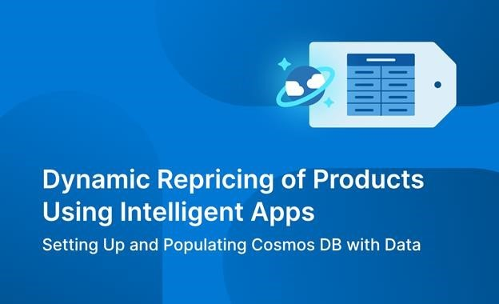

<head> 
  <meta property="og:url" content="https://azure.github.io/cloud-native/60daysofia/dynamic-repricing-of-products-using-intelligent-apps-part-1"/>
  <meta property="og:type" content="website"/> 
  <meta property="og:title" content="Build Intelligent Apps | AI Apps on Azure"/> 
  <meta property="og:description" content="In this series, you’ll learn why Cosmos DB is an ideal choice for powering such applications—and how it makes building Intelligent Apps accessible and approachable. In the first article of this series, you’ll set up and populate the Cosmos DB database with data to use in the later parts of the series."/> 
  <meta property="og:image" content="https://github.com/Azure/Cloud-Native/blob/main/website/static/img/ogImage.png"/> 
  <meta name="twitter:url" content="https://azure.github.io/Cloud-Native/60daysofIA/dynamic-repricing-of-products-using-intelligent-apps-part-1" /> 
  <meta name="twitter:title" content="Build Intelligent Apps | AI Apps on Azure" />
 <meta name="twitter:description" content="In this series, you’ll learn why Cosmos DB is an ideal choice for powering such applications—and how it makes building Intelligent Apps accessible and approachable. In the first article of this series, you’ll set up and populate the Cosmos DB database with data to use in the later parts of the series." />
  <meta name="twitter:image" content="https://azure.github.io/Cloud-Native/img/ogImage.png" /> 
  <meta name="twitter:card" content="summary_large_image" /> 
  <meta name="twitter:creator" content="@devanshidiaries" /> 
  <link rel="canonical" href="https://azure.github.io/Cloud-Native/60daysofIA/dynamic-repricing-of-products-using-intelligent-apps-part-1" /> 
</head> 

<!-- End METADATA -->

*This three-part series demonstrates how to use Azure Cosmos DB to build an Intelligent App that uses historical pricing and product data to forecast future price fluctuations for specific products. In the first article of this series, you’ll set up and populate the Cosmos DB database with data to use in the later parts of the series.*

## Dynamic Repricing of Products Using Intelligent Apps Part 1: Setting Up and Populating Cosmos DB with Data

Intelligent Apps leverage data and artificial intelligence (AI) to provide smart, personalized, and adaptive experiences for users. AI and machine learning (ML) techniques like natural language processing (NLP), computer vision, and deep learning help understand context, intent, and user preferences to deliver relevant and timely insights and actions.

Some examples of Intelligent Apps include:

- **Virtual assistants**—Interactive applications that understand and execute user commands
- **Chatbots**—Automated messaging systems that provide information or assistance
- **Recommendation** systems—Algorithms that suggest relevant items based on user preferences and behavior

In this three-part series, you’ll create an Intelligent App powered by Azure Cosmos DB and AI/ML capabilities that dynamically suggests changes to product prices based on demand and historical trends. This app will help optimize revenue and customer satisfaction by adjusting product prices according to market conditions and customer behavior.

### Laying the Groundwork for an Intelligent App with Cosmos DB

First, you’ll set up an Azure Cosmos DB database and populate it with product data and historical information about sales and demand. In part 2, you’ll analyze this data using AI and ML to forecast and suggest price changes.

#### Prerequisites

To follow this tutorial, ensure you have the following:

- [An Azure account](https://azure.microsoft.com/free/?ocid=buildia24_60days_blogs)
- A [Kaggle account](https://www.kaggle.com/account/login?phase=startRegisterTab&returnUrl=%2F) to download the [dataset](https://www.kaggle.com/datasets/sujaykapadnis/price-quote-data/data) this tutorial uses

#### Create an Azure Cosmos DB Account

Azure Cosmos DB is a fully managed multi-model database that ensures fast access to data, easy scalability, reliable uptime, and strong data consistency. Cosmos DB supports various data models and APIs, including SQL, MongoDB, Cassandra, Gremlin, and table storage, making it easy to query and manipulate data using familiar tools and languages.

Although you already have an Azure account, you also need to create an Azure Cosmos DB account by following the steps below:

1. Sign in to the [Azure portal](https://portal.azure.com/).
2. Click **Create a resource** on the upper-left side of the page.
3. Search for “Azure Cosmos DB” and select it. On the **Azure Cosmos DB** page, select **Create**.
4. Enter the settings for your new account: 
    - Select your desired subscription.
    - Create a new resource group or select an existing one if you have one you’d like to use.
    - Enter a unique account name.
    - Select **SQL (Core)** as the API. This is the default API for Azure Cosmos DB and allows you to use SQL syntax to query and manage your data.
    - Select a **Location** for the account.
    - Click **Review + create**.
5. Review your account settings and click **Create** to create the account.

:::info
Complete the **[Data Skills Challenge](https://aka.ms/intelligent-apps/data-csc?ocid=buildia24_60days_blogs)** to compete for the leaderboard and earn a Microsoft Learn Badge.
:::

#### Create a Database and a Container

Next, you’ll create a database and container within Azure Cosmos DB. Databases facilitate management, billing, and scaling, while a container is a schema-agnostic grouping of items (documents) with a partition key and a provisioned throughput. The partition property determines how the data is distributed across physical partitions for scalability and performance.

To create a database and container, follow the steps below: