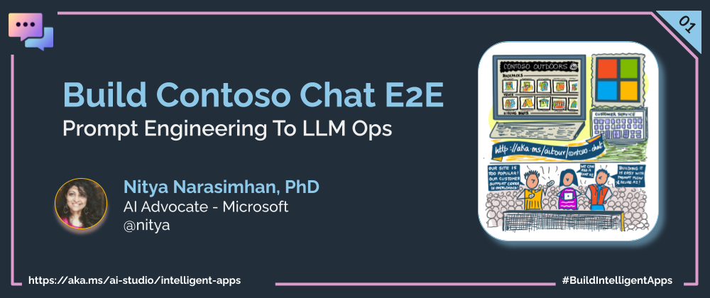
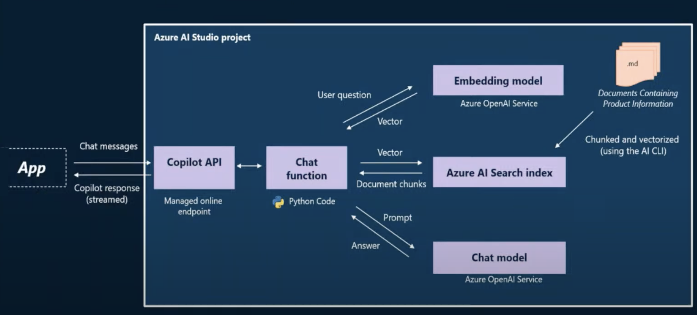

<head> 
  <meta property="og:url" content="https://azure.github.io/cloud-native/60daysofia/fuel-your-intelligent-apps-with-azure-ai"/>
  <meta property="og:type" content="website"/> 
  <meta property="og:title" content="Build Intelligent Apps | AI Apps on Azure"/> 
  <meta property="og:description" content="In this kickoff post, we'll set the stage for the week of posts by describing the application scenario (motivation) and introducing core terminology (LLM Ops), developer tools (Azure AI Studio, frameworks) and design patterns (RAG) to help you jumpstart your journey building and deploying generative AI solutions in the enterprise. By the end of this week, you should have a good understanding of how to build a copilot app end-to-end on the Azure AI platform, how to deploy it for integration with real-world applications, and how to incorporate responsible AI principles into your development workflow."/> 
  <meta property="og:image" content="https://github.com/Azure/Cloud-Native/blob/main/website/static/img/ogImage.png"/> 
  <meta name="twitter:url" content="https://azure.github.io/Cloud-Native/60daysofIA/fuel-your-intelligent-apps-with-azure-ai" /> 
  <meta name="twitter:title" content="Build Intelligent Apps | AI Apps on Azure" />
 <meta name="twitter:description" content="In this kickoff post, we'll set the stage for the week of posts by describing the application scenario (motivation) and introducing core terminology (LLM Ops), developer tools (Azure AI Studio, frameworks) and design patterns (RAG) to help you jumpstart your journey building and deploying generative AI solutions in the enterprise. By the end of this week, you should have a good understanding of how to build a copilot app end-to-end on the Azure AI platform, how to deploy it for integration with real-world applications, and how to incorporate responsible AI principles into your development workflow." />
  <meta name="twitter:image" content="https://azure.github.io/Cloud-Native/img/ogImage.png" /> 
  <meta name="twitter:card" content="summary_large_image" /> 
  <meta name="twitter:creator" content="@devanshidiaries" /> 
  <link rel="canonical" href="https://azure.github.io/Cloud-Native/60daysofIA/fuel-your-intelligent-apps-with-azure-ai" /> 
</head> 

<!-- End METADATA -->

# Kicking Off Azure AI Week!

Welcome to the `Azure AI` week on **#60DaysOfIA**. Over the next 5 days, we'll share a series of blog posts that give you a comprehensive look at the tools and end-to-end development workflow reequired to build intelligent applications [code-first on the Azure AI platform](https://techcommunity.microsoft.com/t5/ai-ai-platform-blog/a-code-first-experience-for-building-a-copilot-with-azure-ai/ba-p/4058659?ocid=buildia24_60days_blogs). 

In this kickoff post, we'll set the stage for the week of posts by describing the application scenario (motivation) and introducing core terminology (LLM Ops), developer tools (Azure AI Studio, frameworks) and design patterns (RAG) to help you jumpstart your journey building and deploying generative AI solutions in the enterprise. By the end of this week, you should have a good understanding of how to build a copilot app end-to-end on the Azure AI platform, how to deploy it for integration with real-world applications, and how to incorporate responsible AI principles into your development workflow.

Ready? Let's get started!

## What We'll Cover Today
 * **Application Scenario |** What is Contoso Chat?
 * **Paradigm Shift |** What is LLM Ops?
 * **Unified Platform |** What is Azure AI Studio?
 * **Copilot Experience |** What is the development workflow?
 * **The Week Ahead |** What will we cover?
 * **Resources:** [Explore the Code-First Azure AI Collection](https://aka.ms/ai-studio/collection?ocid=buildia24_60days_blogs)

---

 

Generative AI applications are transforming the user experience and accelerating adoption of AI tools and solutions in the enterprise. But as developers, we face new challenges in building solutions **end-to-end** - from prompt engineering to LLM Ops. We need new tools, frameworks, and guidance to help us navigate and streamline a fast-growing ecosystem. 

In [a recent blog post](https://techcommunity.microsoft.com/t5/ai-ai-platform-blog/a-code-first-experience-for-building-a-copilot-with-azure-ai/ba-p/4058659?ocid=buildia24_60days_blogs) we described how the Azure AI platform is addressing these challanges with a _code-first experience for building a copilot application end-to-end_ with your data and APIs. This week, we unpack that post in more detail - walking you through a end-to-end application sample, and several _quickstart_ options, to get you started on your own generative AI solutions.

To kick things off, let's set the stage by describing a common generative AI application scenario ("Contoso Chat") and introduce core terminology, tools and processes that we will be using throughout the week, on our development journey.

## 1 | The Application Scenario

Say hello to _Contoso Outdoor Company_ - an online retailer of outdoor adventuring equipment with a loyal and growing customer base. Your website has a rich catalog of items organized into categories like _tents_, _backpacks_, _hiking boots_ and more. Customers visit the site looking to find the best gear for their next adventure, and often have questions about the products, or how they might fit with their previous purchases.

The company has a customer support line, but it is getting overwhelmed with calls and you don't have the resources to meet the demand. You hear about generative AI applications and decide to build a _customer support chat AI_ agent that knows your catalog and customers. You can then integrate it into the site as shown, to improve customer satisfaction and drive follow-up actions.

You identify three requirements for your chat AI application:
 - **Custom Data**. The application responses must prioritize your catalog data.
 - **Responsible AI**. The application must follow responsible AI principles.
 - **LLM Ops**. The end-to-end development workflow must be operationalizable.

## 2 | The Paradigm Shift

Building generative AI applications requires a different mindset from traditional ML applications. The latter are trained on finite custom data, deploying an endpoint that makes _predictions_. By contrast, generative AI applications are trained on massive amounts of data, using large language models (LLM) and natural language processing (NLP) to _generate_ new content.

The focus now moves from **MLOps** (workflow for building ML apps) to **LLMOps** (workflow for building generative AI apps) - starting with _prompt engineering_, a process where we refine the inputs to the LLM ("prompts") through a process of trial-and-error (build-run-evaluate) till the responses meet our quality, cost and performance requirements. The generative AI application lifecycle now looks more like this:

1. **Ideation Phase**: Start by building the basic AI application (copilot) for your scenario. At this stage, you define the architectural elements (AI resources, design patterns) and language models (chat completion, chat evaluation, text embeddings) that you will need to build-run-evaluate the basic experience. And have sample data to test against.
2. **Augmentation Phase**: Iteratively refine the quality and performance of your application by _engineering_ the prompts, _tuning_ the models, and _evaluating_ the responses with sample data (smal) and batch runs (large). Use relevant metrics (groundedness, coherence, relevance, fluency) to guide decisions on what to change, and when to stop iterating.
3. **Operationalization Phase:** Now, you're ready to deploy the application to a production environment so that the endpoint can be accessed by others, for integrating into user-facing experiences. This is also a good time to review the entire workflow for responsible AI practices, and explore automation and monitoring solutions for efficiency and performance.

## 3 | The Azure AI Platform

Implementing this end-to-end workflow and managing the various phases of the application lifecycle can be challenging for developers. Azure AI Studio addresses these challenges with a [**unified platform**](https://ai.azure.com?ocid=buildia24_60days_blogs) for building generative AI applications and custom copilot experiences. 

Use the platform to **explore** language models from Microsoft and the broader community, and experiment with them in a built-in playground. Then **build** your 
AI project by seamlessly integrating with deployed models and built-in AI services - and **manage** your AI resources (for compute, access, billing and more) from the unified UI. 

As a developer, you have both low-code and code-first options for engaging with the platform. Use the [Azure AI Studio UI](https://ai.azure.com?ocid=buildia24_60days_blogs) for a browser-based low-code experience, and the [Azure AI SDK](https://learn.microsoft.com/azure/ai-studio/how-to/sdk-generative-overview?ocid=buildia24_60days_blogs) for a Python-based code-first experience. In our posts this week, we'll focus on the code-first experience, and show you how to build a copilot app on Azure AI using the Python SDK and popular frameworks.

## 4 | The Copilot Experience

So how do we get started on the end-to-end development journey using the Azure AI platform? Let's start by defining what we mean by a _copilot_ experience for enterprise-grade generative AI applications. A copilot is:
 - a generative AI application that uses large language models (LLM) and natural language processing (NLP) 
 - to assist customers in completing complex cognitive tasks **using your data** 
 - typically using conversational “chat” interactions (request-reponse)

The copilot (generative AI application) is deployed in the cloud to expose an interaction endpoint (API) that can be integrated into customer-facing experiences (e.g,, web or mobile apps) for real-world use. For our specific application scenario, the implementation will involve two components:
 - Contoso Chat (copilot API) as the backend component with the chat AI
 - Contoso Outdoors (web App) as the frontend component with the chat UI

 

The figure shows the high-level application architecture for [building generative AI applications using custom code with Azure AI](https://www.youtube.com/watch?v=UbJg7RNLi7E), where the **App** represents the front-end component and the blue box encloses the components of the **Copilot** implementation exposed through the managed online endpoint (API). The copilot experience now involves the following steps:
 - The user (customer) asks a question from the chat UI (web app)
 - The web app sends the question to the chat API (copilot endpoint)
 - The chat API invokes our custom Python code (chat function) which:
    - converts the user question (prompt) into a machine-friendly format (vector)
    - uses the vectorized prompt to find matches in our custom data (search index)
    - combines the user question with custom results for an enhanced prompt
    - sends this prompt to the chat model to get the completion (answer)
 - The chat API now returns the answer as a response to the chat UI request

To build this workflow requires us to complete the following steps:
 1. Provision the necessary resources on Azure
 1. Create the search index using our custom data
 1. Deploy chat and embedding models for use by the chat function
 1. Configure connections between chat function and models, resources
 1. Write the code to _orchestrate_ the steps for the chat function
 1. Deploy our chat function to expose the API endpoint online
 1. Integrate the API endpoint with our front-end application for usage

From an LLM Ops perspective, we also need to consider two additional steps:
 1. Evaluation of the chat function using sample data - to assess quality
 1. Automation of the workflow steps - for iteration and operationalization

This is a non-trivial set of requirements for building, running, evaluating, and deploying a generative AI application. Thankfully, the Azure AI platform and related ecosystem of tools and services, helps streamline the process for developers - allowing us to focus on our chat function logic and user experience.

## 5 | The Week Ahead!

In the upcoming week, we'll dive into the implementation details of these processes in the context of a signature reference sample (Contoso Chat) and as quickstart templates that showcase usage with popular frameworks. Here's what we'll cover:
- [**Day 1:**](https://azure.github.io/Cloud-Native/60DaysOfIA/build-contoso-chat-end-to-end) Build the Contoso Chat app on Azure AI (end-to-end reference sample)
- **Day 2:** Build a Copilot app on Azure AI with the Python SDK (quickstart)
- **Day 3:** Build a Copilot app on Azure AI with promptflow (framework)
- **Day 4:** Build a Copilot app on Azure AI with LangChain (framework)
- **Day 5:** Deploy your Copilot app responsibly on Azure AI (advanced topics)