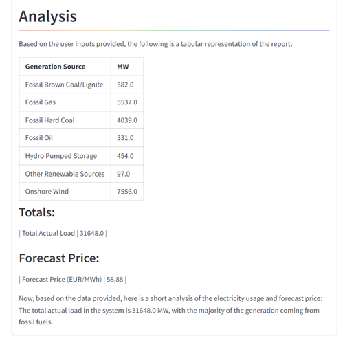

<head> 
  <meta property="og:url" content="https://azure.github.io/cloud-native/60daysofia/forecasting-energy-usage-with-intelligent-apps-3"/>
  <meta property="og:type" content="website"/> 
  <meta property="og:title" content="Build Intelligent Apps | AI Apps on Azure"/> 
  <meta property="og:description" content="Join us on a learning journey to build intelligent apps on Azure. Read all about the upcoming #BuildIntelligentApps initiative on this post!"/> 
  <meta property="og:image" content="https://github.com/Azure/Cloud-Native/blob/main/website/static/img/ogImage.png"/> 
  <meta name="twitter:url" content="https://azure.github.io/Cloud-Native/60daysofIA/forecasting-energy-usage-with-intelligent-apps-3" /> 
  <meta name="twitter:title" content="Build Intelligent Apps | AI Apps on Azure" />
 <meta name="twitter:description" content="This three-part series demonstrates how to create an Intelligent App that forecasts future energy consumption and pricing based on historical data." />
  <meta name="twitter:image" content="https://azure.github.io/Cloud-Native/img/ogImage.png" /> 
  <meta name="twitter:card" content="summary_large_image" /> 
  <meta name="twitter:creator" content="@devanshidiaries" /> 
  <link rel="canonical" href="https://azure.github.io/Cloud-Native/60daysofIA/forecasting-energy-usage-with-intelligent-apps-3" /> 
</head> 

<!-- End METADATA -->


*This three-part series demonstrates how to create an Intelligent App that forecasts future energy consumption and pricing based on historical data. In this final installment of the series, you’ll create a basic web interface that enables the user to input energy usage data and parameters, output the results and the model-generated report into the web interface for easy viewing. Finally, you’ll deploy using the AKS environment set up in Part 1. *

## Forecasting Energy Usage with Intelligent Apps Part 3: Adding a Web Interface

In [Part 1 of this series](https://azure.github.io/Cloud-Native/60DaysOfIA/forecasting-energy-usage-with-intelligent-apps-1), you set up an [Azure Kubernetes Service](https://azure.microsoft.com/products/kubernetes-service?ocid=buildia24_60days_blogs) (AKS) cluster and prepared it for automated deployment with the help of [Kubernetes AI Toolchain Operator](https://azure.microsoft.com/updates/preview-ai-toolchain-operator-addon-for-aks/?ocid=buildia24_60days_blogs) (KAITO) and Llama 2. Then, in [Part 2](https://azure.github.io/Cloud-Native/60DaysOfIA/forecasting-energy-usage-with-intelligent-apps-2), you built a model that predicts future energy usage/pricing based on parameters input by the user and set up the Intelligent App’s back end.

In this third and final article of the series, you’ll create a primary web interface that empowers users to input energy usage data and parameters to generate forecasts. Through this interface, users can gain insights into future energy demands, aiding in strategic decision-making and resource allocation.

Let’s dive in!

### Prerequisites

To follow along, ensure you have:

 - Completed Parts [1](https://azure.github.io/Cloud-Native/60DaysOfIA/forecasting-energy-usage-with-intelligent-apps-1) and [2](https://azure.github.io/Cloud-Native/60DaysOfIA/forecasting-energy-usage-with-intelligent-apps-2) of this series
 - A code editor like [Visual Studio Code](https://code.visualstudio.com/)
 - Python 3.10 or higher
 - The new Forecast web app [source code](https://github.com/contentlab-io/Microsoft-Forecasting-Energy-Usage-with-Intelligent-Apps/tree/main/Part%202) downloaded

For a sneak peek of the final product, check out the [complete project code](https://github.com/contentlab-io/Microsoft-Forecasting-Energy-Usage-with-Intelligent-Apps/tree/main/Part%203).

### Building an Intelligent App with Azure Kubernetes Service and KAITO

In this tutorial, you’ll create a basic web interface that enables the user to input or upload energy usage data and parameters to generate future predictions of usage/pricing. Then, you’ll output the results and the report generated from the model into the web interface for easy viewing. Finally, you’ll deploy the Intelligent App using the AKS environment you set up in Part 1.

:::info
Checkout the [Intelligent Apps on AKS: Episode 4](https://aka.ms/learn-live-building-intelligent-apps-aks-ep4?ocid=buildia24_60days_blogs), a technical deep dive hands-on training with an expert on how to use AKS and Azure to take your intelligent app global.
:::

#### Creating the Web Interface

To develop your web interface, you’ll use [streamlit](https://streamlit.io/)—a Python framework for creating web apps. This combination offers flexibility and ease of development, enabling seamless data processing and integration of visualization components.

*The User Interface*

The core of your web interface is a streamlit form where users can input relevant parameters. The form includes fields for adding data related to electricity generation from different sources. Upon submitting the form, users trigger the prediction process. 

Locate the directory of the source code you have downloaded and open the [app.py file](https://github.com/contentlab-io/Microsoft-Forecasting-Energy-Usage-with-Intelligent-Apps/blob/main/Part%202/app.py). It centralizes the logic needed by the new Forecast app to process user input and produce the price prediction and analysis.

For simplicity, let’s review just the most pertinent parts of the file:

```
# omitted for brevity 

def generate_report(user_input, price):  

    # Get the IP address from the environment variable 
    IP_ADDRESS = os.environ.get('ENERGYFORECASTAPI_IP') 

    # Endpoint URL 
    url = f'http://{IP_ADDRESS}/predict-chat' 

    # Request payload 

    payload = { 

# omitted for brevity 

    } 

    # Header 
    headers = {'Content-Type': 'application/json'} 

    # Perform the request 
    response = requests.post(url, json=payload, headers=headers) 

    # Check the response 
    if response.status_code == 200: 
        print("Response:", response.json()) 
        json_data = response.json() 
        report = json_data['results'][0][1]['content'] 
        return report 
    else: 
        st.header('Error', divider='rainbow') 
        print("Error:", response.text) 
        return response.text 

def get_forecast_price(user_input): 
    model = load('xgb_model.joblib')        
    price = np.float64(model.predict(user_input)[0]) 
    price = np.around(price, 2) 
    return price 

st.title("Predicting Energy Pricing") 
st.write("This Intelligent App analyzes data on energy consumption and predicts the electricity price for the next hour. It then creates a report summarizing the electricity usage and price.") 

with st.form("my_form"): 

# some parts were omitted for brevity 

       user_input = [[np.float64(generation_fossil_brown_coal_lignite), np.float64(generation_fossil_gas),  
                      np.float64(generation_fossil_hard_coal), np.float64(generation_fossil_oil), 
                      np.float64(generation_hydro_pumped_storage_consumption), np.float64(generation_other_renewable), 
                      np.float64(generation_wind_onshore), np.float64(total_load_actual), hour, weekday, month, business_hour, 
                      weekend]] 
        
       price = get_forecast_price(user_input) 

       st.header('Forecast Price', divider='rainbow') 
       st.write(f"{str(round(price, 2))} EUR/MW") 

       report = generate_report(user_input, price) 

       st.header('Analysis', divider='rainbow') 
       st.write(report) 
```

##### Building and Pushing to ACR
Open your terminal at the root directory of the Forecast app’s source code you downloaded earlier. Run the pair of commands below to initiate and use a Python virtual environment:

```
python -m venv .env 

.env\Scripts\activate 
```

Then, run the following command to complete the installation of dependencies of your Python project: 

```
pip install -r requirements.txt
```

Execute the following commands to build the image locally and push it to your Azure Container Registry (ACR). Be sure to replace `<username>` and `<password>` with your username and password.

```
sudo docker build --no-cache -f Dockerfile -t forecast-web -t <YOUR-ACR-NAME>.azurecr.io/forecast-web:latest . 

docker login <YOUR-ACR-NAME>.azurecr.io --username <username> --password-stdin <password> 

docker push <YOUR-ACR-NAME>.azurecr.io/forecast-web:latest 
```

##### Connecting to AKS

Start by making sure you’re logged in to Azure and that you have the correct AKS credentials by running the following command: 

```
az login --tenant <YOUR-AZURE-TENANT-ID>
```

Next, run the following commands to enable access to your AKS cluster via your terminal: 

```
export RESOURCE_GROUP=<YOUR-RESOURCE-GROUP> 
export MY_CLUSTER=<YOUR-AKS-CLUSTER-NAME> 
export LOCATION=<YOUR-LOCATION> 
export SUBSCRIPTION=<YOUR-AZURE-SUBSCRIPTION> 

az account set --subscription $SUBSCRIPTION 
az aks get-credentials --resource-group $RESOURCE_GROUP --name $MY_CLUSTER 
```

#### Deployment

Before deploying, you need to retrieve the cluster IP of the Forecast API service running on your AKS cluster. Execute the following command in your terminal:

```
> kubectl get svc forecast-api-service 
```

Copy the inference service’s cluster IP:

```
NAME                   TYPE           CLUSTER-IP   EXTERNAL-IP     PORT(S)        AGE 
forecast-api-service   LoadBalancer   <CLUSTERIP>  <EXTERNAL-IP>   80:32306/TCP   46h 
```

Next, modify the `deployment.yaml` file using the code below, replacing the `<ENERGY-FORECAST-API-IP>` placeholder below with the Forecast API service’s cluster IP value you copied above:

```
apiVersion: apps/v1 
kind: Deployment 
metadata: 
  name: forecast-web-deployment 
spec: 
  replicas: 1 
  selector: 
    matchLabels: 
      app: forecast-web 
  template: 
    metadata: 
      labels: 
        app: forecast-web 
    spec: 
      containers: 
      - name: forecast-web 
        image: openaidemoacr.azurecr.io/forecast-web:latest 
        ports: 
        - containerPort: 8501 
        env: 
        - name: ENERGYFORECASTAPI_IP 
          value: <ENERGY-FORECAST-API-IP> 
```

Then, save the updated `deployment.yaml` file.

Execute the following commands to provision a new pod and deploy the service to your AKS cluster:

```
snap install kubectl --classic 
kubectl apply -f deployment.yaml 
kubectl apply -f service.yaml 
```

**Note:** After the deployment commands have been applied, the Forecast web app may take a few minutes to get up and running.

:::info
Complete the [Intelligent Apps Skills Challenge](https://aka.ms/intelligent-apps/apps-csc?ocid=buildia24_60days_blogs) to compete for the leaderboard and earn a Microsoft Learn Badge. 
:::

##### Running the Web App

Now that the Forecast web app is deployed, let’s try it out!

Run the command below and grab your app’s external IP:

```
> kubectl get svc forecast-web-service 

NAME                   TYPE           CLUSTER-IP   EXTERNAL-IP     PORT(S)        
forecast-web-service   LoadBalancer   10.0.81.68   <EXTERNAL-IP>   80:30805/TCP 
```

Now, paste the `<External-IP>` into a new web browser tab to test your Forecast web app:


Fill in the form with the energy fields, plus the date and time, and hit **Submit**.

Once you submit the form, you’ll see predictions for energy prices categorized and a detailed report summarizing the electricity usage and price.

Once the form is submitted, the Forecast web queries the model trained in Part 2 and obtains the forecast price. Then, it accesses the Forecast API service, which is hosted in your AKS cluster, to produce the summary report using the generative capabilities of the Llama2 Chat model:



### Why Build Intelligent Apps with KAITO?

KAITO provides significant advantages when building an AI project. One key benefit is the drastic reduction in time and effort required to deploy AI models. This is because KAITO automates many complex tasks that traditionally demand significant manual intervention.

Without utilizing KAITO, building an AI project within Kubernetes could present several challenges:

 - You need to manually handle complex tasks, like provisioning infrastructure resources, deploying models, managing endpoints, and optimizing resource utilization. The manual approach takes substantial time and effort and increases the likelihood of errors and inconsistencies across deployments. 
 - The absence of automated infrastructure provisioning may result in suboptimal resource allocation and higher operational costs. 

But with the help of KAITO, you can swiftly deploy hosted models from a variety of open-source repositories or custom models—all without the need for extensive expertise in Kubernetes infrastructure management. Moreover, KAITO facilitates the seamless provisioning of infrastructure resources tailored to the specific requirements of AI workloads, optimizing cost efficiency and operational effectiveness.

For more details, refer to this [Microsoft Ignite presentation](https://www.youtube.com/watch?v=9EvA9gbTS9M&t=676s).

### Conclusion

In this article, you created a web interface using Streamlit, Docker, and Kubernetes, allowing users to input data and generate insights into energy usage patterns.

Azure technologies provide solutions for reducing carbon footprint and promoting sustainability. The [Carbon Aware Keda Operator](https://github.com/Azure/carbon-aware-keda-operator) is one such innovation designed to reduce the carbon footprint of Kubernetes resources. 

Now that you’ve had hands-on experience in building an Intelligent App, join the [Cloud Skill Challenges](https://aka.ms/intelligent-apps/csc) and check out the [Ask The Expert session](https://aka.ms/intelligent-apps/ate-aks?ocid=buildia24_60days_blogs) with the AKS product team to keep up with the latest in cloud computing. And don’t forget about the **AKS [Customer](https://aka.ms/aks-day) and [Lab](https://aka.ms/aks-lab-day) Days** at KubeCon EU, a great opportunity to network with AKS and Azure experts. Let’s work together to drive innovation!  