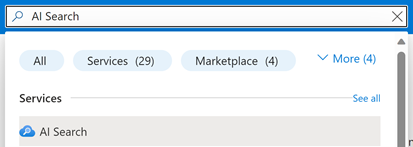
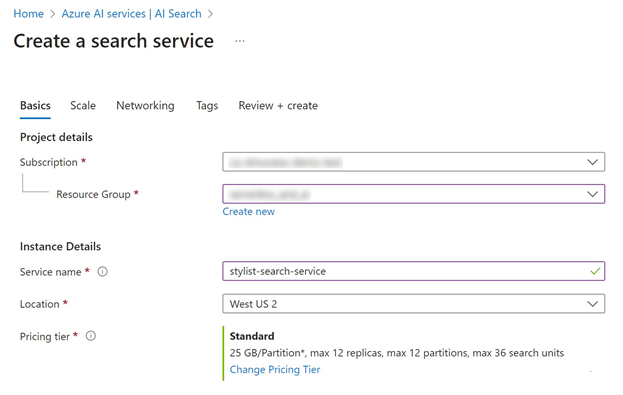
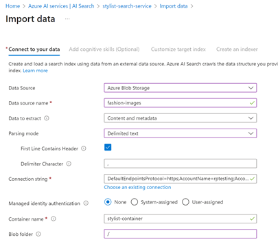
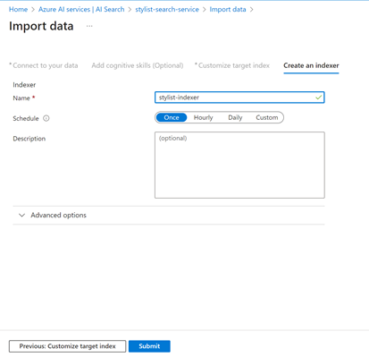

<head> 
  <meta property="og:url" content="https://azure.github.io/cloud-native/60daysofia/creating-a-virtual-stylist-chatbot-part-1"/>
  <meta property="og:type" content="website"/> 
  <meta property="og:title" content="Build Intelligent Apps | AI Apps on Azure"/> 
  <meta property="og:description" content="In this three-part series, you’ll build a virtual stylist chatbot that uses AI to analyze images and suggest clothing items. In this first part, you’ll analyze clothing images using AI to generate a text description of the piece, focusing on the clothing’s characteristics. "/> 
  <meta property="og:image" content="https://github.com/Azure/Cloud-Native/blob/main/website/static/img/ogImage.png"/> 
  <meta name="twitter:url" content="https://azure.github.io/Cloud-Native/60daysofIA/creating-a-virtual-stylist-chatbot-part-1" /> 
  <meta name="twitter:title" content="Build Intelligent Apps | AI Apps on Azure" />
 <meta name="twitter:description" content="In this three-part series, you’ll build a virtual stylist chatbot that uses AI to analyze images and suggest clothing items. In this first part, you’ll analyze clothing images using AI to generate a text description of the piece, focusing on the clothing’s characteristics. " />
  <meta name="twitter:image" content="https://azure.github.io/Cloud-Native/img/ogImage.png" /> 
  <meta name="twitter:card" content="summary_large_image" /> 
  <meta name="twitter:creator" content="@devanshidiaries" /> 
  <link rel="canonical" href="https://azure.github.io/Cloud-Native/60daysofIA/creating-a-virtual-stylist-chatbot-part-1" /> 
</head> 

<!-- End METADATA -->


## Creating a Virtual Stylist Chatbot — Part 1: Analyzing Images with AI

Ever wished you had a personal fashion consultant who could help you find the ideal outfit for any occasion? What if you could use artificial intelligence (AI) to create a virtual stylist chatbot that could analyze clothing in images and suggest the perfect match from a database of clothing options.

This assistant is an example of an intelligent app—an application that leverages AI to enhance and personalize its user experience.

In this three-part series, you’ll learn how to build your own AI stylist app. When you’re done, you’ll have an app that can understand the contents of user-uploaded images and recommends similar items from a fashion image dataset.

The first article of this series demonstrates how to create the app’s core logic. It analyzes the clothing styles in the image and finds the closest match in the dataset using Azure AI Search, Azure OpenAI Service, and Azure Functions. In the later parts of the series, you’ll add a chatbot interface to the app.

Let’s get started!

### Prerequisites

Before you start, ensure you have:

* Python 3.10 or later
* An Azure subscription with access to [Azure OpenAI Service](https://azure.microsoft.com/products/ai-services/openai-service?ocid=buildia24_60days_blogs)
* [Azure command-line interface (CLI)](https://learn.microsoft.com/cli/azure/?ocid=buildia24_60days_blogs) installed
* [Azure Functions Core Tools](https://github.com/Azure/azure-functions-core-tools) installed
* An Azure OpenAI Service resource with a GPT-4 Vision model deployed. Read the [resource deployment guide](https://learn.microsoft.com/azure/ai-services/openai/how-to/create-resource?pivots=web-portal&ocid=buildia24_60days_blogs) if you haven’t yet deployed a model. Note that [GPT-4 Vision](https://learn.microsoft.com/azure/ai-services/openai/concepts/models?ocid=buildia24_60days_blogs#model-summary-table-and-region-availability) is only available in the Sweden Central and West US regions, so be sure to select either of those two.
* The deployment name, endpoint, and API key for your OpenAI Service. See the “Retrieve key and endpoint” section in the [Azure OpenAI Service docs](https://learn.microsoft.com/azure/ai-services/openai/dall-e-quickstart?pivots=programming-language-python?ocid=buildia24_60days_blogs#retrieve-key-and-endpoint) for details on finding your model’s endpoint URL and API key.
* The [Fashion Product Images dataset](https://www.kaggle.com/datasets/paramaggarwal/fashion-product-images-small) from Kaggle. Download and unzip the dataset. You’ll only need the CSV file in part 1, but keep all the images because you’ll use them later in the series.
* Familiarity with Python
* [Flask installed](https://flask.palletsprojects.com/en/3.0.x/installation/)
* [Visual Studio Code](https://code.visualstudio.com/Download) or another code editor of your choice

For a preview, refer to the complete code for [part 1 available on GitHub](https://github.com/rogerwinter/Microsoft-Creating-a-Virtual-Stylist-Chatbot/tree/main/stylist-backend).

### Analyzing Clothing Styles with AI

With the prerequisites in place, it’s time to create an app from scratch. It will use Azure AI Search, Azure Functions (in Python), and Azure OpenAI Service to do the following:

* Accept an image uploaded from a web interface. It should be an image of a clothing item or a person wearing one or more pieces of clothing.
* Analyze that image using Azure OpenAI GPT-4 Turbo with Vision to generate a text description of the piece. Focus on describing the characteristics of the clothing.
* Use the text description of the clothing’s characteristics to find its closest matches in the clothing dataset.
* Return a suggestion from the dataset of which clothing items are the best matches.

:::info
Complete the **[Intelligent Apps Skills Challenge](https://aka.ms/intelligent-apps/apps-csc?ocid=buildia24_60days_blogs)** to compete for the leaderboard and earn a Microsoft Learn Badge.
:::

#### Create the Search Index and Upload the Dataset

First, you must create a search index and upload the dataset that contains the clothing options. You’ll use Azure AI Search, which can automatically ingest and parse the CSV data supplied with the fashion image dataset.

Begin by uploading the CSV data included in the [fashion dataset](https://www.kaggle.com/datasets/paramaggarwal/fashion-product-images-small) into Azure Blob Storage. Navigate to the Storage Accounts page to get started. To find it quickly, enter its name in the Azure Portal’s search bar:


When the page loads, choose an existing storage account if you already have one. If not, create a new one. Click the storage account’s name to load its dashboard page. Then, click **Upload** to upload a new file:


Next, select the `styles.csv` file from the fashion dataset downloaded from Kaggle.


If you have an existing storage container you’d like to use, select it from the dropdown menu. Otherwise, click the link to create a new one. Either way, ensure the container is empty before proceeding. The `styles.csv` file you upload should be the only file in the container.

Now, you’re ready to create the AI Search service. Look it up using the Azure Portal search box:



When the AI Search page loads, click **+ Create** to create a new AI Search instance.


Select the subscription and resource group you’d like to use to create the search service. Then, enter a unique name of your choice — this demonstration uses “stylist-search-service.”



Use the defaults for all remaining settings and click **Create** to create the search service. This may take a few minutes. The Azure Portal will let you know when the service is ready.

Now, it’s time to index the data in the `styles.csv` file you uploaded to Blob Storage earlier. From the main page of your new search index, click **Import data**.


In the first data import screen, select **Azure Blob Storage** as the data source and enter “fashion-images” as the data source name. Choose **Delimited text** as the parsing mode, and enter a comma as the delimiter character. For the connection string, click **Choose an existing connection** and select the storage container where you uploaded `styles.csv`. Delete the forward slash in the Blob folder input box. Azure will auto-populate the connection string.



Click **Next** until Azure prompts you to customize the target index, and then update the field settings as follows:


Click **Next**. On the final screen, enter a name for the indexer and click **Submit**.



Azure will create a search index and then run the ingester to import the data. It should finish in under two minutes. When it does, you’re done with search index creation.

:::info
Register for the new learning series on **[Intelligent Apps with Serverless on Azure](https://aka.ms/serverless-learn-live?ocid=buildia24_60days_blogs)**. Join the community along with MVPs, and the Azure Product Group on how to leverage AI with Serverless on Azure technologies –Azure Functions and Azure Container Apps – to build intelligent applications.
:::

#### Create the Azure Function

The next step is to create the Azure Function that will perform image analysis, matching logic, and recommendation generation. You’ll use Python as the programming language and Flask as the web framework.

To create and deploy the Azure Functions app, use the Azure Functions CLI. Open a terminal and create a new directory to store your app. Then, run:

```
func init --python
```

The app generator will run. Open the directory in Visual Studio Code or your text editor of choice. You should see several files:


Open `requirements.txt` and add the following:

```
azure-functions
requests
azure-search-documents
```

This change ensures Azure will install all the dependencies the function needs before trying to run it.

Next, open `function_app.py` and replace its contents with the following:

```
import base64
import os
import json
import requests
import azure.functions as func
from azure.search.documents import SearchClient
from azure.core.credentials import AzureKeyCredential

app = func.FunctionApp()

# Get the environment variables
OPENAI_API_KEY = os.environ['OPENAI_API_KEY']
OPENAI_ENDPOINT = os.environ['OPENAI_ENDPOINT']
OPENAI_DEPLOYMENT_NAME = os.environ['OPENAI_DEPLOYMENT_NAME']
SEARCH_API_KEY = os.environ['SEARCH_API_KEY']
SEARCH_ENDPOINT = os.environ['SEARCH_ENDPOINT']
SEARCH_INDEX_NAME = os.environ['SEARCH_INDEX_NAME']

# Initialize the Azure OpenAI headers
openai_headers = {
    'Authorization': 'Bearer {}'.format(OPENAI_API_KEY),
    'Content-Type': 'application/json'
}

# Initialize the Azure Search client
search_credentials = AzureKeyCredential(SEARCH_API_KEY)
search_client = SearchClient(SEARCH_ENDPOINT, SEARCH_INDEX_NAME, search_credentials)

@app.route(route="stylist", methods=["post"], auth_level=func.AuthLevel.FUNCTION)
def stylist(req: func.HttpRequest) -> func.HttpResponse:
    # get image from request and convert to a base64 string
    image = req.files["image"]
    image_bytes = image.read()
    image_base64 = base64.b64encode(image_bytes).decode("utf-8")

    # Generate a text description from the image using Azure OpenAI
    base_url = f"{OPENAI_ENDPOINT}openai/deployments/{OPENAI_DEPLOYMENT_NAME}"
    endpoint = f"{base_url}/chat/completions?api-version=2023-12-01-preview"
    data = {
        "messages": [
            { "role": "system", "content": "You are a helpful assistant." },
            { "role": "user", "content": [
                {
                    "type": "text",
                    "text": "Describe the main fashion item in this picture. Make sure you include the type of item (e.g., Shirt, T-Shirt, Shorts, Pants, Dress, Purse, Clutch), the color of the item, and 'Men' or 'Women' if the fashion item appears to be specific to either of those genders."
                },
                {
                    "type": "image_url",
                    "image_url": {
                        "url": image_base64
                    }
                }
            ] }
        ],
        "max_tokens": 2000
    }

    response = requests.post(endpoint, headers=openai_headers, data=json.dumps(data))
    result = response.json()
    image_description = result['text']

    # Find the closest match from the search index using Azure OpenAI
    search_result = search_client.search(
        search_text=image_description,
        select=["id", "productDisplayName"],
        top=1
    )
    match_id = search_result["id"]
    match_name = search_result["productDisplayName"]

    # Generate a natural language recommendation based on the match result using Azure OpenAI
    data = {
        "messages": [
            { "role": "system", "content": "You are a helpful assistant." },
            { "role": "user", "content": [
                {
                    "type": "text",
                    "text": f"Please generate a natural language recommendation based on the matching item: {match_id}, {match_name}. For example: The best match for your clothing item is: Peter England Men Party Blue Jeans. This is a pair of jeans for men in blue color, suitable for casual occasions. You can pair it with a shirt or a t-shirt of your choice."
                }
            ] }
        ],
        "max_tokens": 2000
    }
    response = requests.post(endpoint, headers=openai_headers, data=json.dumps(data))
    result = response.json()
    recommendation = result['text']

    # Return the recommendation as a JSON response
    return func.HttpResponse(json.dumps({
        'image_id': match_id,
        'recommendation': recommendation
    })) 
```

Let’s break down what’s happening step by step.

First, you set up the function app and Azure clients. This code:

* Initializes an Azure Function with an HTTP trigger
* Retrieves necessary API keys and endpoints from environment variables for OpenAI and Azure Search services
* Sets up headers for interacting with Azure OpenAI Service and a client for using Azure Search

Then, you define the `process_image` function. This function:

* Is the application’s code and executes on a specific request to the Flask app
* Receives an image as part of the request

Next, you generate text descriptions with Azure OpenAI. This code:

* Constructs a request to Azure OpenAI Service’s chat API to generate a description of the main fashion item in the image. The request includes the image and a prompt to describe the fashion item, including its type, color, and gender specificity.
* Sends the request and extracts the generated description from the response

After, you search for a matching product. This code:

* Uses the Azure Search client to search for a product that matches the description generated by OpenAI. The search query uses the textual description and selects specific fields (`id`, `productDisplayName`) from the search index.
* Extracts the ID and display name of the closest matching product from the search results

Then, you generate a natural language recommendation. This code:

* Constructs another request to Azure OpenAI Service’s chat API to generate a natural language recommendation based on the matching product. The request includes the matching product’s details and asks for a natural language recommendation.
* Sends the request and extracts the recommendation from the response

Next, the code returns the recommendation:

* The function ends by returning a JSON response containing the matching product’s ID and the natural language recommendation.
* The ID matches the file name of an image in the dataset, so you can use it to load and display images in the web UI in parts 2 and 3 of this series.

Finally, you define a main function:

* This is the function Azure runs to boot the function app and prepare it to receive HTTP requests.

This app combines image processing, text generation, and search capabilities to provide fashion item recommendations. It demonstrates how to implement the entire back end of an intelligent application.

#### Deploy the Azure Function

The final step is to deploy the Azure Function to the cloud so the web interface can access it. Start by using the Azure CLI to create a new function app:

```
az functionapp create --resource-group <RESOURCE_GROUP_NAME> --consumption-plan-location westus --runtime python --runtime-version 3.9 --functions-version 4 --name <APP_NAME> --os-type linux --storage-account <STORAGE_NAME> 
```

You can use the same resource group and storage account you used for the search service.

**Note**: The app name must be unique, so you might need to try a few options to find one available.

Next, set all the environment variables the app will need by running:

```
az functionapp config appsettings set –name <APP_NAME> --resource-group <RESOURCE_GROUP> --settings
OPENAI_API_KEY=<your Azure OpenAI key>
OPENAI_ENDPOINT=<your Azure OpenAI endpoint>
OPENAI_DEPLOYMENT_NAME=<your Azure OpenAI deployment name>
SEARCH_API_KEY=<your Search API key>
SEARCH_ENDPOINT=<your Search service endpoint>
SEARCH_INDEX_NAME=<your Search index name>
```

If you’re unsure where to find any of these values, here’s how to locate them:

* For the OpenAI values, find and load the Azure OpenAI page by entering OpenAI in the Azure Portal search bar. Click the name of your Azure OpenAI service, and you’ll see two menu options:

  

  Click **Keys and Endpoint** to locate the required information, or click **Model deployments** to navigate to Azure OpenAI Studio and find the names of your model deployments.

* For the search service, load your stylist search service’s page in Azure Portal:

  * On the **Overview** page, the **Url** value is your search endpoint.
  * Click **Keys** in the menu to access your search service’s keys.
  * Click **Indexes** in the menu to see the name of your search service’s index.

Note that you’re saving these as app settings for simplicity. In a product app, you should keep secrets like API keys safe by using [Azure Key Vault](https://azure.microsoft.com/products/key-vault?ocid=buildia24_60days_blogs).

Once you’ve created the app and saved its settings, you can deploy your function by running the following command from the Azure Functions CLI:

```
func azure functionapp publish <APP_NAME>
```

The CLI will begin deploying your app. When the deployment is complete, the interface will provide a URL to send HTTPS requests to the function app.

Now, the back end of the stylist chatbot app is complete! You’re ready to move on to creating the web interface for the app.

:::info
Join the Azure Functions product group for an **[Ask The Expert](https://aka.ms/intelligent-apps/ate-functions?ocid=buildia24_60days_blogs)** session on how to focus on the pieces of code that matter most to you in AI application development, while Azure Functions handles the rest for you.
:::

### Next Steps

In this article, you learned how to create a virtual stylist chatbot that can analyze clothing styles in an image and identify the best match from a dataset of clothing options — leveraging Azure Functions and Azure OpenAI Service to do so. You also learned how to use Azure AI Search feature to index, store, and retrieve entries from a search index. Next, you discovered how to use Azure OpenAI Service to generate natural language descriptions and recommendations based on the user’s input image.

In the next part of this series, you’ll learn how to add a chatbot interface to the app using React and an [Azure Static Web App](https://azure.microsoft.com/products/app-service/static?ocid=buildia24_60days_blogs).  