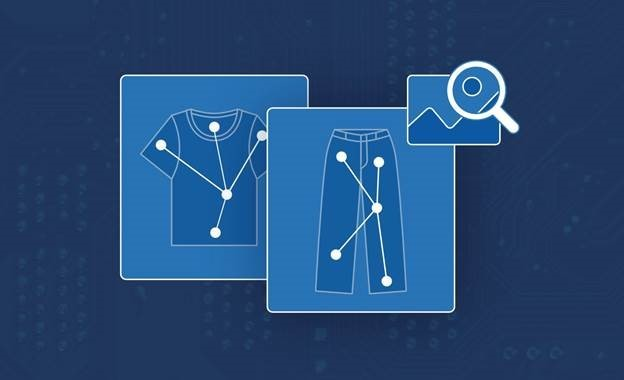
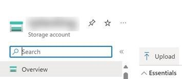

<head> 
  <meta property="og:url" content="https://azure.github.io/cloud-native/60daysofia/creating-a-virtual-stylist-chatbot-part-1"/>
  <meta property="og:type" content="website"/> 
  <meta property="og:title" content="Build Intelligent Apps | AI Apps on Azure"/> 
  <meta property="og:description" content="In this three-part series, you’ll build a virtual stylist chatbot that uses AI to analyze images and suggest clothing items. In this first part, you’ll analyze clothing images using AI to generate a text description of the piece, focusing on the clothing’s characteristics. "/> 
  <meta property="og:image" content="https://github.com/Azure/Cloud-Native/blob/main/website/static/img/ogImage.png"/> 
  <meta name="twitter:url" content="https://azure.github.io/Cloud-Native/60daysofIA/creating-a-virtual-stylist-chatbot-part-1" /> 
  <meta name="twitter:title" content="Build Intelligent Apps | AI Apps on Azure" />
 <meta name="twitter:description" content="In this three-part series, you’ll build a virtual stylist chatbot that uses AI to analyze images and suggest clothing items. In this first part, you’ll analyze clothing images using AI to generate a text description of the piece, focusing on the clothing’s characteristics. " />
  <meta name="twitter:image" content="https://azure.github.io/Cloud-Native/img/ogImage.png" /> 
  <meta name="twitter:card" content="summary_large_image" /> 
  <meta name="twitter:creator" content="@devanshidiaries" /> 
  <link rel="canonical" href="https://azure.github.io/Cloud-Native/60daysofIA/creating-a-virtual-stylist-chatbot-part-1" /> 
</head> 

<!-- End METADATA -->

## Creating a Virtual Stylist Chatbot — Part 1: Analyzing Images with AI

Ever wished you had a personal fashion consultant who could help you find the ideal outfit for any occasion? What if you could use artificial intelligence (AI) to create a virtual stylist chatbot that could analyze clothing in images and suggest the perfect match from a database of clothing options.

This assistant is an example of an intelligent app—an application that leverages AI to enhance and personalize its user experience.

In this three-part series, you’ll learn how to build your own AI stylist app. When you’re done, you’ll have an app that can understand the contents of user-uploaded images and recommends similar items from a fashion image dataset.

The first article of this series demonstrates how to create the app’s core logic. It analyzes the clothing styles in the image and finds the closest match in the dataset using Azure AI Search, Azure OpenAI Service, and Azure Functions. In the later parts of the series, you’ll add a chatbot interface to the app.

Let’s get started!

### Prerequisites

Before you start, ensure you have:

* Python 3.10 or later
* An Azure subscription with access to [Azure OpenAI Service](https://azure.microsoft.com/products/ai-services/openai-service?ocid=buildia24_60days_blogs)
* [Azure command-line interface (CLI)](https://learn.microsoft.com/cli/azure/?ocid=buildia24_60days_blogs) installed
* [Azure Functions Core Tools](https://github.com/Azure/azure-functions-core-tools) installed
* An Azure OpenAI Service resource with a GPT-4 Vision model deployed. Read the [resource deployment guide](https://learn.microsoft.com/azure/ai-services/openai/how-to/create-resource?pivots=web-portal&ocid=buildia24_60days_blogs) if you haven’t yet deployed a model. Note that [GPT-4 Vision](https://learn.microsoft.com/azure/ai-services/openai/concepts/models?ocid=buildia24_60days_blogs#model-summary-table-and-region-availability) is only available in the Sweden Central and West US regions, so be sure to select either of those two.
* The deployment name, endpoint, and API key for your OpenAI Service. See the “Retrieve key and endpoint” section in the [Azure OpenAI Service docs](https://learn.microsoft.com/azure/ai-services/openai/dall-e-quickstart?pivots=programming-language-python?ocid=buildia24_60days_blogs#retrieve-key-and-endpoint) for details on finding your model’s endpoint URL and API key.
* The [Fashion Product Images dataset](https://www.kaggle.com/datasets/paramaggarwal/fashion-product-images-small) from Kaggle. Download and unzip the dataset. You’ll only need the CSV file in part 1, but keep all the images because you’ll use them later in the series.
* Familiarity with Python
* [Flask installed](https://flask.palletsprojects.com/en/3.0.x/installation/)
* [Visual Studio Code](https://code.visualstudio.com/Download) or another code editor of your choice

For a preview, refer to the complete code for [part 1 available on GitHub](https://github.com/rogerwinter/Microsoft-Creating-a-Virtual-Stylist-Chatbot/tree/main/stylist-backend).

### Analyzing Clothing Styles with AI

With the prerequisites in place, it’s time to create an app from scratch. It will use Azure AI Search, Azure Functions (in Python), and Azure OpenAI Service to do the following:

* Accept an image uploaded from a web interface. It should be an image of a clothing item or a person wearing one or more pieces of clothing.
* Analyze that image using Azure OpenAI GPT-4 Turbo with Vision to generate a text description of the piece. Focus on describing the characteristics of the clothing.
* Use the text description of the clothing’s characteristics to find its closest matches in the clothing dataset.
* Return a suggestion from the dataset of which clothing items are the best matches.

:::info
Complete the **[Intelligent Apps Skills Challenge](https://aka.ms/intelligent-apps/apps-csc?ocid=buildia24_60days_blogs)** to compete for the leaderboard and earn a Microsoft Learn Badge.
:::

#### Create the Search Index and Upload the Dataset

First, you must create a search index and upload the dataset that contains the clothing options. You’ll use Azure AI Search, which can automatically ingest and parse the CSV data supplied with the fashion image dataset.

Begin by uploading the CSV data included in the [fashion dataset](https://www.kaggle.com/datasets/paramaggarwal/fashion-product-images-small) into Azure Blob Storage. Navigate to the Storage Accounts page to get started. To find it quickly, enter its name in the Azure Portal’s search bar:

When the page loads, choose an existing storage account if you already have one. If not, create a new one. Click the storage account’s name to load its dashboard page. Then, click **Upload** to upload a new file:

Next, select the `styles.csv` file from the fashion dataset downloaded from Kaggle.

