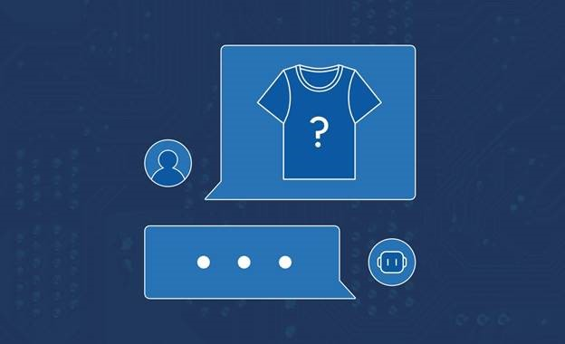

<head> 
  <meta property="og:url" content="https://azure.github.io/cloud-native/60daysofia/creating-a-virtual-stylist-chatbot-part-2"/>
  <meta property="og:type" content="website"/> 
  <meta property="og:title" content="Build Intelligent Apps | AI Apps on Azure"/> 
  <meta property="og:description" content="In this four-part series, you’ll build a virtual stylist chatbot that uses AI to analyze images and suggest clothing items. In this second installment, you’ll design the chatbot’s interface."/> 
  <meta property="og:image" content="https://github.com/Azure/Cloud-Native/blob/main/website/static/img/ogImage.png"/> 
  <meta name="twitter:url" content="https://azure.github.io/Cloud-Native/60daysofIA/creating-a-virtual-stylist-chatbot-part-2" /> 
  <meta name="twitter:title" content="Build Intelligent Apps | AI Apps on Azure" />
 <meta name="twitter:description" content="In this four-part series, you’ll build a virtual stylist chatbot that uses AI to analyze images and suggest clothing items. In this second installment, you’ll design the chatbot’s interface." />
  <meta name="twitter:image" content="https://azure.github.io/Cloud-Native/img/ogImage.png" /> 
  <meta name="twitter:card" content="summary_large_image" /> 
  <meta name="twitter:creator" content="@devanshidiaries" /> 
  <link rel="canonical" href="https://azure.github.io/Cloud-Native/60daysofIA/creating-a-virtual-stylist-chatbot-part-2" /> 
</head> 

<!-- End METADATA -->



## Creating a Virtual Stylist Chatbot — Part 2: Adding a Chatbot Interface

Welcome to part 2 of this tutorial series on creating a virtual stylist chatbot using Azure OpenAI Service.  

In [part 1](https://azure.github.io/Cloud-Native/60DaysOfIA/creating-a-virtual-stylist-chatbot-part-1), you built the chatbot app’s back end using Azure Functions, Azure AI Services, and GPT-4 Vision with Azure OpenAI Service. That tutorial covered using these services to analyze an image of a fashion item or outfit and generate natural language responses and recommendations based on it.

In this second installment, you’ll create a chatbot interface for your virtual stylist app using Vite, Vue, TypeScript, and vue-advanced-chat. You’ll learn how to use these tools to build a web application that allows you to interact with your stylist bot conversationally.

### Prerequisites

Before you start, ensure you have:

* An Azure subscription with access to [Azure OpenAI Service](https://azure.microsoft.com/products/ai-services/openai-service?ocid=buildia24_60days_blogs)
* [Azure command-line interface (CLI)](https://learn.microsoft.com/cli/azure/?ocid=buildia24_60days_blogs) installed
* [Azure Functions Core Tools](https://github.com/Azure/azure-functions-core-tools) installed
* An Azure OpenAI Service resource with a GPT-4 Vision model deployed
* The deployment name, endpoint, and API key for your OpenAI Service
* The [Fashion Product Images dataset](https://www.kaggle.com/datasets/paramaggarwal/fashion-product-images-small) from Kaggle
* [Node.js 20](https://nodejs.org/en/download/) or later installed on your local machine 
* A text editor that supports Vue and TypeScript. If you use Visual Studio Code, consider installing the [TypeScript Vue Plugin](https://marketplace.visualstudio.com/items?itemName=Vue.vscode-typescript-vue-plugin) to ensure the editor understands all the files you’re about to create. 

For a preview, refer to the complete code for [part 1 available on GitHub](https://github.com/rogerwinter/Microsoft-Creating-a-Virtual-Stylist-Chatbot/tree/main/stylist-backend).


### Creating a Chatbot Interface for Your Virtual Stylist

In this section, you’ll create a chatbot interface for the virtual stylist app using Vue and vue-advanced-chat. You’ll use Vue to create the main components of the app, including the header, the footer, the chat window, and the image upload button. You’ll also use the vue-advanced-chat library to create the chat messages, chat input, and other chat options, using Tailwind CSS to style the app.

:::info
Complete the **[Intelligent Apps Skills Challenge](https://aka.ms/intelligent-apps/apps-csc?ocid=buildia24_60days_blogs)** to compete for the leaderboard and earn a Microsoft Learn Badge.
:::

#### Setting Up the Project

The first step is creating a new Vue project using Vite. Vite is a fast and lightweight build tool that provides a smooth developer experience and supports features like hot module replacement, code splitting, and tree shaking.

To create a new Vue project with Vite, run the following command in your terminal:

```
npm init vite@latest virtual-stylist-chat -- --template vue-ts
```

This builds a new folder, `virtual-stylist-chat`, with the following structure:

```
virtual-stylist-chat 
├── index.html 
├── package.json 
├── public 
│   └── favicon.svg 
├── src 
│   ├── App.vue 
│   ├── assets 
│   │   └── logo.svg 
│   ├── components 
│   │   └── HelloWorld.vue 
│   ├── main.ts 
│   └── shims-vue.d.ts 
└── tsconfig.json 
```

Next, add a few dependencies:


```
virtual-stylist-chat 
├── index.html 
├── package.json 
├── public 
│   ├── favicon.svg 
│   └── images 
│       ├── 10001.jpg 
│       ├── 10002.jpg 
│       ├── 10003.jpg 
│       ├── ... 
│       ├── 19998.jpg 
│       ├── 19999.jpg 
│       └── 20000.jpg 
├── src
│   ├── App.vue
│   ├── assets
│   │   └── logo.svg
│   ├── components
│   │   └── HelloWorld.vue
│   ├── main.ts
│   ├── styles.css
│   ├── tailwind.config.js
│   ├── postcss.config.js
│   └── shims-vue.d.ts
└── tsconfig.json
```
