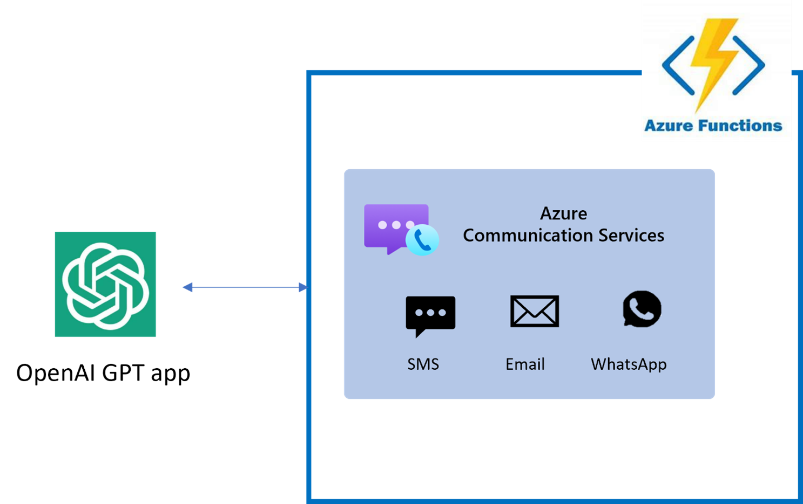

<head> 
  <meta property="og:url" content="https://azure.github.io/cloud-native/60daysofia/building-a-multichannel-notification-system-1"/>
  <meta property="og:type" content="website"/> 
  <meta property="og:title" content="Build Intelligent Apps | AI Apps on Azure"/> 
  <meta property="og:description" content="This blog post outlines a step-by-step guide on building such a multichannel notification system with Azure Functions and Azure Communication Services."/> 
  <meta property="og:image" content="https://github.com/Azure/Cloud-Native/blob/main/website/static/img/ogImage.png"/> 
  <meta name="twitter:url" content="https://azure.github.io/Cloud-Native/60daysofIA/building-a-multichannel-notification-system-1" /> 
  <meta name="twitter:title" content="Build Intelligent Apps | AI Apps on Azure" />
 <meta name="twitter:description" content="This blog post outlines a step-by-step guide on building such a multichannel notification system with Azure Functions and Azure Communication Services." />
  <meta name="twitter:image" content="https://azure.github.io/Cloud-Native/img/ogImage.png" /> 
  <meta name="twitter:card" content="summary_large_image" /> 
  <meta name="twitter:creator" content="@devanshidiaries" /> 
  <link rel="canonical" href="https://azure.github.io/Cloud-Native/60daysofIA/building-a-multichannel-notification-system-1" /> 
</head> 

<!-- End METADATA -->

## Building a Multichannel Notification System 1

In the interconnected digital era, it's crucial for businesses and services to communicate effectively with their audience. A robust notification system that spans various communication channels can greatly enhance user engagement and satisfaction. This blog post outlines a step-by-step guide on building such a multichannel notification system with Azure Functions and Azure Communication Services.

Leveraging serverless architecture and the reach of Azure Communication Services, your application can dynamically generate and send messages via SMS, Email, and WhatsApp. By incorporating OpenAI GPTs, the system can create content that is not only relevant and timely but personalized, making communication more impactful.

Architecture Diagram

Here are some practical scenarios where a multichannel notification system is valuable: 

  1. **Financial Alerts**: Banks and financial services can send fraud alerts, transaction confirmations, and account balance updates.
  2. **Healthcare Reminders**: Clinics and pharmacies can notify patients about appointment schedules, vaccinations, or prescription refills.
  3. **Security Verification**: Services requiring secure authentication can utilize two-factor authentication prompts sent via SMS or WhatsApp.
  4. **Marketing and Promotions**: Retailers can craft and distribute targeted marketing messages and promotions, thereby driving customer engagement.
  5. **Infrastructure Notifications**: Utility companies can alert customers about service disruptions, maintenance schedules, or conservation tips.
  6. **E-commerce Updates**: Online retailers can inform customers about order confirmations, shipping details, and delivery tracking.

The foundation of this solution is [Azure Functions](https://docs.microsoft.com/azure/azure-functions/?ocid=buildia24_60days_blogs), a flexible, event-driven platform for running scalable applications with minimal overhead. We will utilize [Azure Communication Services](https://docs.microsoft.com/azure/communication-services/?ocid=buildia24_60days_blogs), which provides reliable APIs for Email, SMS, and WhatsApp messaging. To generate content, we use [OpenAI GPTs](https://openai.com/blog/introducing-gpts), which enables the creation of sophisticated, context-aware text that can be used in notifications.

By following this tutorial, you will gain the knowledge and practical experience necessary to implement a scalable multichannel notification platform that can serve a wide array of communication needs. Let's get started on your path to building a cutting-edge, serverless messaging system on Azure.

### Prerequisites

Before we dive into building our multichannel notification system with Azure Functions and Azure Communication Services, you will need to ensure that the following tools and accounts set up: 

  1. **Azure Account**: You'll need a Microsoft Azure account to create and manage resources on Azure. If you haven't got one yet, you can [create a free account here](https://azure.microsoft.com/free/?ocid=buildia24_60days_blogs).
  2. **Visual Studio Code**: We'll be using Visual Studio Code (VS Code) as our Integrated Development Environment (IDE) for writing and debugging our code. Download and install it from [here](https://code.visualstudio.com/).
  3. **Azure Functions Extension for Visual Studio Code**: This extension provides you with a seamless experience for developing Azure Functions. It can be installed from the [VS Code marketplace](https://marketplace.visualstudio.com/items?itemName=ms-azuretools.vscode-azurefunctions).
  4. **C# Dev Kit**: Since we're writing our Azure Functions in C#, this extension is necessary for getting C# support in VS Code. You can install it from the [VS Code marketplace](https://marketplace.visualstudio.com/items?itemName=ms-dotnettools.csdevkit).
  5. **Azure CLI**: The Azure Command-Line Interface (CLI) will be used to create and manage Azure resources from the command line. For installation instructions, visit the Azure CLI installation [documentation page](https://docs.microsoft.com/cli/azure/install-azure-cli?ocid=buildia24_60days_blogs).
  6. **Postman**: Although not strictly necessary, Postman is a handy tool for testing our HTTP-triggered Azure Functions without having to write a front-end application. You can download Postman from [getpostman.com](https://www.getpostman.com/).

With the prerequisites in place, you're ready to set up your development environment, which we will cover in the following section.

