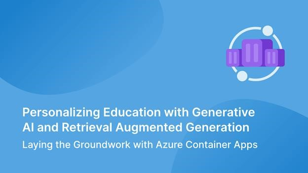

<head> 
  <meta property="og:url" content="https://azure.github.io/cloud-native/60daysofia/personalizing-education-with-generative-ai-and-retrieval-augmented-generation-1"/>
  <meta property="og:type" content="website"/> 
  <meta property="og:title" content="Build Intelligent Apps | AI Apps on Azure"/> 
  <meta property="og:description" content="In this three-part series, you’ll use Azure Container Apps, Azure OpenAI Service, and Retrieval Augmented Generation to create a personal tutor chatbot that dynamically adjusts educational materials and quizzes based on user interactions. This article shows how to set up the core Azure AI services required to build your Intelligent App."/> 
  <meta property="og:image" content="https://github.com/Azure/Cloud-Native/blob/main/website/static/img/ogImage.png"/> 
  <meta name="twitter:url" content="https://azure.github.io/Cloud-Native/60daysofIA/personalizing-education-with-generative-ai-and-retrieval-augmented-generation-1" /> 
  <meta name="twitter:title" content="Build Intelligent Apps | AI Apps on Azure" />
 <meta name="twitter:description" content="In this three-part series, you’ll use Azure Container Apps, Azure OpenAI Service, and Retrieval Augmented Generation to create a personal tutor chatbot that dynamically adjusts educational materials and quizzes based on user interactions. This article shows how to set up the core Azure AI services required to build your Intelligent App." />
  <meta name="twitter:image" content="https://azure.github.io/Cloud-Native/img/ogImage.png" /> 
  <meta name="twitter:card" content="summary_large_image" /> 
  <meta name="twitter:creator" content="@devanshidiaries" /> 
  <link rel="canonical" href="https://azure.github.io/Cloud-Native/60daysofIA/personalizing-education-with-generative-ai-and-retrieval-augmented-generation-1" /> 
</head> 

<!-- End METADATA -->

## Personalizing Education with Generative AI and Retrieval Augmented Generation Part 1: Laying the Groundwork with Azure Container Apps

Tired of one-size-fits-all learning? Imagine a virtual tutor that adjusts to your specific needs and helps you understand complex topics. That’s the power of Intelligent Apps — apps that leverage machine learning (ML), data analytics, and predictive/generative artificial intelligence (AI) to create dynamic, interactive user experiences.

In this three-part series, you’ll build an education app that uses generative AI and Retrieval Augmented Generation (RAG) to create customized lessons, answer users’ questions in detail, and generate quizzes that adapt to their progress. You’ll use several exciting Azure technologies:

* [Azure OpenAI Service](https://azure.microsoft.com/products/ai-services/openai-service?ocid=buildia24_60days_blogs) — Provides the core AI capabilities for your app
* [Azure AI Search](https://azure.microsoft.com/products/ai-services/ai-search?ocid=buildia24_60days_blogs) — Offers a knowledge base that your app can access using RAG, allowing the large language model (LLM) to provide more accurate explanations
* [Azure Container Apps](https://azure.microsoft.com/products/container-apps?ocid=buildia24_60days_blogs) — Lets you easily package and run apps in a flexible and scalable environment.

