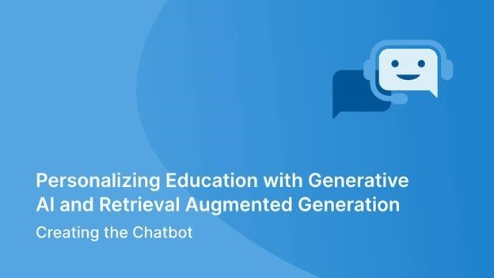
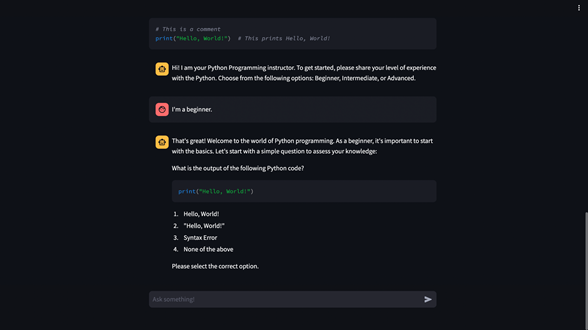

<head> 
  <meta property="og:url" content="https://azure.github.io/cloud-native/60daysofia/personalizing-education-with-generative-ai-and-retrieval-augmented-generation-2"/>
  <meta property="og:type" content="website"/> 
  <meta property="og:title" content="Build Intelligent Apps | AI Apps on Azure"/> 
  <meta property="og:description" content="In this three-part series, you’ll use Azure Container Apps, Azure OpenAI Service, and Retrieval Augmented Generation to create a personal tutor chatbot that dynamically adjusts educational materials and quizzes based on user interactions. This article shows how to set up the core Azure AI services required to build your Intelligent App."/> 
  <meta property="og:image" content="https://github.com/Azure/Cloud-Native/blob/main/website/static/img/ogImage.png"/> 
  <meta name="twitter:url" content="https://azure.github.io/Cloud-Native/60daysofIA/personalizing-education-with-generative-ai-and-retrieval-augmented-generation-2" /> 
  <meta name="twitter:title" content="Build Intelligent Apps | AI Apps on Azure" />
 <meta name="twitter:description" content="Azure and platform engineering pave the way for the efficient development, deployment, and maintenance of Intelligent Apps, triumphing over traditional approaches." />
  <meta name="twitter:image" content="https://azure.github.io/Cloud-Native/img/ogImage.png" /> 
  <meta name="twitter:card" content="summary_large_image" /> 
  <meta name="twitter:creator" content="@devanshidiaries" /> 
  <link rel="canonical" href="https://azure.github.io/Cloud-Native/60daysofIA/personalizing-education-with-generative-ai-and-retrieval-augmented-generation-2" /> 
</head> 

<!-- End METADATA -->



*In this three-part series, you’ll use Azure Container Apps, Azure OpenAI Service, and Retrieval Augmented Generation to create a personal tutor chatbot that dynamically adjusts educational materials and quizzes based on user interactions. This article walks you through building the chatbot application’s logic.*

## Personalizing Education with Generative AI and Retrieval Augmented Generation Part 2: Creating the Chatbot

In the [first article](https://azure.github.io/cloud-native/60daysofia/personalizing-education-with-generative-ai-and-retrieval-augmented-generation-1) of this series, you set up essential Azure services and prepared your knowledge base. Now, you’ll build on this foundation to develop a chatbot that interacts with users and takes the lead in dynamically adjusting educational materials.

Let’s get coding!

### Prerequisites

To follow this tutorial, ensure you have the following:

* An Azure subscription with access to the [Azure OpenAI Service](https://azure.microsoft.com/products/ai-services/openai-service?ocid=buildia24_60days_blogs)
* Access to the Azure services set up in Part 1
* [Python](https://www.python.org/downloads/) 3.10 or later 
* A [Streamlit](https://streamlit.io/) account. Streamlit is an open-source Python framework that supports machine learning (ML) tasks. 
* A code editor or integrated development environment (IDE), like [Visual Studio Code](https://code.visualstudio.com/download)

For a preview of the project, check out the [complete code](https://github.com/contentlab-io/Personalizing-Education-with-Generative-AI-and-RAG) for this tutorial. 

:::info
Checkout the demo bytes for [Intelligent Apps](https://developer.microsoft.com/en-us/reactor/series/S-1308/?wt.mc_id=blog_S-1308_webpage_reactor&ocid=buildia24_60days_blogs) with Azure Container Apps where the product engineering team gives a walkthrough on using open-source vector databases and building a multi-LLM chat application. 
:::

### Code a Web Interface for Your Personal Tutor

In this tutorial, you’ll design a chatbot using Streamlit and the Azure OpenAI Service. This chatbot will:

* Ask users for their experience level (beginner, intermediate, or advanced). 
* Ask a question about the topic based on the user’s experience level. If the user struggles to answer the question correctly, the chatbot will explain what the correct answer is and why. 
* Use Retrieval Augmented Generation (RAG) to access the knowledge base for answers, additional information, and dynamic question generation. 
* Adapt the difficulty of questions based on how the user performs on quizzes.

#### Retrieving API Keys and Endpoints

Before you start coding, ensure you have the following credentials, which allow you to connect your application to the Azure OpenAI Service and make a call:

* **Azure OpenAI endpoint** — Locate your Azure OpenAI service in the Azure portal. Find the endpoint in the **Overview** section.  
* **Azure OpenAI key** — To retrieve the key, navigate to **Keys and Endpoint** under **Resource Management**.  
* **Azure OpenAI deployment ID** — This is the name of the GPT-4 model you deployed in Part 1. You can find this value in the Azure AI Studio under **Resource Management** > **Deployments**. 
* **Azure AI Search endpoint** — Find this value by opening your Azure AI Search service from the Azure portal and locating the **URL** value in the **Overview** section.  
* **Azure AI Search key** — Navigate to **Settings** > **Keys** in your Azure AI Search resource to find this value.  
* **Azure AI Search index** — This value is the name of your Azure AI Search index. You can find it in the **Overview** section of your Azure AI Search resource in the Azure portal.

Once you have the values for all the above variables, export them as environment variables. Set up your Python project by creating a new directory. From this directory, run the following commands in the terminal, replacing the placeholders with the values: 

```
export AOAIEndpoint=<Azure OpenAI Endpoint> 
export AOAIKey=<Azure OpenAI Key> 
export AOAIDeploymentId=<Azure OpenAI Deployment ID> 
export SearchEndpoint=<Search Endpoint> 
export SearchKey=<Search Key> 
export SearchIndex=<Search Index> 
```

**Note:** The method will vary slightly based on your operating system.

### Create the Python App

Next, you’ll build the chatbot. In your project directory, create a new file named `main.py`. This will be the heart of your application.

#### Adding Libraries

A couple of libraries are essential to build your chatbot. In your terminal or command prompt, install `streamlit` and `openai` using a package manager, such as pip.

Start by creating a function, `read_markdown_file`, to load and read the course content from different existing `.md` files ([`basic_python.md`](https://github.com/contentlab-io/Personalizing-Education-with-Generative-AI-and-RAG/blob/main/basic_python.md), [`intermediate_python.md`](https://github.com/contentlab-io/Personalizing-Education-with-Generative-AI-and-RAG/blob/main/intermediate_python.md), [`advanced_python.md`](https://github.com/contentlab-io/Personalizing-Education-with-Generative-AI-and-RAG/blob/main/advanced_python.md)). You’ll display the course content using `streamlit`:

```
import streamlit as st 
from pathlib import Path 
import openai  # We'll configure OpenAI access soon 

# Function to read course content 
def read_markdown_file(markdown_file): 
    """Reads a Markdown file (.md) and returns its contents as text.""" 
    return Path(markdown_file).read_text() 

# Welcome Message 
st.markdown("""Welcome to this e-learning course on Python programming!  
               This course is designed for learners of all levels. Whether you're  
               just starting out or want to master advanced concepts, our adaptive  
               system will tailor lessons and quizzes to your needs.""") 

# Tabs for Skill Levels 
tab1, tab2, tab3 = st.tabs(["Beginner", "Intermediate", "Advanced"]) 

# Load Course Content (You'll need to create these .md files) 
with tab1: 
   st.header("Beginner") 
   st.markdown(read_markdown_file("beginner_python.md")) 

with tab2: 
   st.header("Intermediate") 
   st.markdown(read_markdown_file("intermediate_python.md")) 

with tab3: 
   st.header("Advanced") 
   st.markdown(read_markdown_file("advanced_python.md")) 
```

#### Retrieving Environment Variables

Next, retrieve the environment variables you set earlier and initialize the client object, establishing the connection to the Azure OpenAI Service: 

```
from openai import AzureOpenAI 

endpoint = os.environ.get("AOAIEndpoint") 
api_key = os.environ.get("AOAIKey") 
deployment = os.environ.get("AOAIDeploymentId") 

client = AzureOpenAI( 
    base_url=f"{endpoint}/openai/deployments/{deployment}/extensions", 
    api_key=api_key, 
    api_version="2023-08-01-preview", 
) 
```

#### Setting Up the Chatbot Logic

Lastly, set up the logic for the chatbot: 

```
# Set a default model 
if "openai_model" not in st.session_state: 
    st.session_state["openai_model"] = "gpt-4" 

# Initialize chat history 
if "messages" not in st.session_state: 
    st.session_state.messages = [] 
    st.session_state.messages= [{"role": "assistant", "content": """Hi! I am your Python Programming instructor. To get started, please share your level of experience with Python. Choose from the following options: Beginner, Intermediate, or Advanced."""}] 

# Display chat messages from history on app rerun 
for message in st.session_state.messages: 
    with st.chat_message(message["role"]): 
        st.markdown(message["content"]) 

# React to user input 
if prompt:= st.chat_input("Ask something!"): 
    # Display user message in chat message container 
    st.chat_message("user").markdown(prompt) 
    # Add user message to chat history 
    st.session_state.messages.append({"role": "user", "content": prompt}) 

    try: 
        # Display assistant response in chat message container 
        with st.chat_message("assistant"): 
            completion = client.chat.completions.create( 
                model = deployment, 
                messages = [ 
                    {"role": m["role"], "content": m["content"]} 
                    for m in st.session_state.messages 
                ], 
            extra_body={ 
            "dataSources": [ 
                { 
                    "type": "AzureCognitiveSearch", 
                    "parameters": { 
                        "endpoint": os.environ["SearchEndpoint"], 
                        "key": os.environ["SearchKey"], 
                        "indexName": os.environ["SearchIndex"], 
                        "queryType": "vector", 
                        "semanticConfiguration": "default", 
                        "inScope": True, 
                        "filter": None, 
                        "strictness": 3, 
                        "topNDocuments": 5, 
                        "embeddingDeploymentName": "embedding-model", 
                        "roleInformation": """You are a dynamic Python programming instructor. Your role is to assess the user's knowledge and provide a tailored learning experience. Based on the user's response, you will take a quiz on a specific Python topic suitable for their level. If the user answers correctly, increase the difficulty of subsequent questions. If incorrect, provide hints, then either simplify the question or present a similar one at the same level. Your responses should evolve based on the user's experience level and their performance on the quizzes.""" 
                        } 
                } 
                ]  
                }, 
                n = 1, 
                temperature=0, 
                top_p=1, 
                max_tokens=200, 
                stop=[], 
                stream=False 
            ) 

            response = completion.choices[0].message.content 
            st.markdown(response) 

        # Add assistant response to chat history 
        st.session_state.messages.append({"role": "assistant", "content": response}) 

    except Exception as e: 
        st.error(f"An error occurred: {e}") 
```

There’s a lot of code here, so let’s review the chatbot logic code step by step:

* Streamlit uses the `st.session_state` variable to set the session state and preserve information across interactions with your app. The `messages` variable inside `st.session_state` maintains the chat history as a list of dictionaries, each with a "`role`" (`user` or `assistant`) and "`content`". 
* `st.chat_input` handles user input and displays it within the conversation. 
* You use the `chat.completions` API to make requests to your Azure OpenAI deployment. The chat history is included for context using the `messages` parameter.  
* The `extra_body` parameter sets up RAG with configuration details for the Azure AI Search instance, embedding model, and instructions for the AI’s behavior. The parameters within the `extra_body` include: 
  * `type`, specifying the knowledge source as “AzureCognitiveSearch” (now known as [Azure AI Search](https://learn.microsoft.com/azure/search/whats-new?ocid=buildia24_60days_blogs#new-service-name)). 
  * `parameters`, providing essential details like your Azure AI Search endpoint, API key, index name, and various query parameters to target the appropriate information. 
  * The `roleInformation` section within `extra_body`, guiding the model’s behavior. It explains the role of a dynamic Python instructor, with instructions on assessing the user’s knowledge, conducting quizzes, and adapting the learning experience. 
  * The temperature parameter, controlling the level of randomness and creativity injected into the model’s response. By setting this to 0, the model favors words with the highest probabilities, leading to more predictable, safe, and potentially generic responses.

This code snippet only works if you’ve set up an Azure AI Search instance and correctly configured your environment variables (`SearchEndpoint`, `SearchKey`, and `SearchIndex`). 

#### Running the Chatbot App

To start your web server locally, run the following command in your terminal:

```
python -m streamlit run main.py
```


Upon launching the app, you’ll see a welcome message and three tabs: Beginner, Intermediate, and Advanced. Each tab contains preconfigured course materials sourced from .md files. You can click any tab to access the relevant content.

Further down, you’ll find the chatbot interface. The chatbot initiates the conversation by asking you to specify your difficulty level.  

After you provide your answer, the chatbot will administer a short quiz to assess your knowledge at that level. If you answer correctly, the app will progressively increase the difficulty of subsequent questions. 



### Next Steps

In this tutorial, you set up your chatbot interface using Streamlit, connected it to Azure OpenAI, and implemented the core conversation logic. Your chatbot is in good shape and ready for action! In the final part of this series, you’ll deploy your app as a web application using Azure Container Apps. See you there!

Want to continue your learning journey? We’re glad to hear it — and we have a few ways for you to stay engaged. Watch the first demo byte covering [Intelligent Apps with Azure Container Apps](https://developer.microsoft.com/reactor/series/S-1308/?wt.mc_id=blog_S-1308_webpage_reactor&ocid=buildia24_60days_blogs) using Qdrant and register for the upcoming live episode for the [Serverless on Azure Learn Live](https://developer.microsoft.com/reactor/events/22146/?ocid=buildia24_60days_blogs) series. 